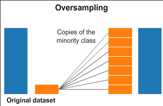

```{r setup, include=FALSE}
options(digits = 3)
knitr::opts_chunk$set(
	dpi = 200,
	echo = TRUE,
	warning = FALSE,
	message = FALSE,
	tidy = TRUE,
	comment = "r >",
	digits = 3)

#knitr::write_bib(x=c("caret","ggplot2","rpart", "e1071", "randomForest", "gbm", "xgboost", "doParallel", "adabag", "caretEnsemble", "pROC"), 
#			file = "files/stesura/knitcitations.bib")

load("Workspace.RData")
pacman::p_load(tidyverse, magrittr, caret, rpart, randomForest, gbm, xgboost, kableExtra, pROC, doParallel, tictoc)

data = read_csv("IBM-HR.csv",
	col_types = cols(
		Attrition = col_factor(),
		Gender = col_factor(),
		EducationField = col_factor(),
		MaritalStatus = col_factor(),
		JobRole = col_factor(),
		BusinessTravel = col_factor(),
		Department = col_factor(),
		Education = col_factor(),
		EducationField = col_factor(),
		OverTime = col_factor()))

Categorical.Variables <- names(Filter(is.factor, data %>% select(-Attrition)))
Numeric.Variables <- names(Filter(is.numeric, data))
```
<h5 style="font-style: italic; font-weight: 400;">
Máster en Minería de Datos e Inteligencia de Negocios
</h5>
<h5 style="font-style: italic; font-weight: 400;">
Técnicas de Machine Learning
</h5>
<hr style="border-top: 3px solid #bbb; border-radius: 5px;">
::: {.row}
::: {.col-md-4}

Este trabajo está orientado a predecir una variable binaria o continua a través de diferentes algoritmos de clasificación o estimación relaccionados con árboles y otros.

En este caso, he querido explorar un dataset de *RRHH* desarollado por **IBM**. Es posible descargarlo aquí:
```{r download, echo=FALSE}
suppressPackageStartupMessages(library(downloadthis))
data %>% download_this(
    output_name = "Dataset",
    output_extension = ".csv",
    button_label = "Descargar Data as CSV",
    button_type = "default",
    has_icon = TRUE,
    icon = "fa fa-save")
```
:::

::: {.col-md-4}
El objetivo de este informe es predecir el índice de deserción de los empleados, identificando también las causas que más lo influencian.

Este es un conjunto de datos *ficticio* creado por científicos de datos. Por esta razón espero métricas de los modelos elevadas
:::

::: {.col-md-4}
[](https://www.kaggle.com/pavansubhasht/ibm-hr-analytics-attrition-dataset)
:::
:::

# Abstracto {-}
A lo largo de esta análisis, he analizado el conjunto de datos **IBM Employee Attrition** para explorar las causas principales de la deserción en una empresa. Primero, a través de un análisis exploratorio, me he asegurado que los datos esteban limpios. 
En esta etapa, me dí cuenta que los datos tenían un problema de desbalanceo entre las clases de la variable dependiente, para arreglar este problema he ampliado la muestra de la clase menor.

Una vez que los datos estaban listos, he empezado la modelización del **árbol de decisión**, **bagging**, **random forest**, **gradient boosting machine (GBM)** y **extreme gradient boosting machine (XGBM)**. Para cada técnica, mi flujo de trabajo ha sido lo siguiente:

1. Tunear los parámetros de cada modelo, con la función `train` del paquete `caret`, empleando un bucle cuando la función no permite el control de unos parámetros y utilizando *computación paralela* sobre tres procesadores.
2. Entender el andamiento del ajuste para los distintos parámetros tuneados a través unos gráficos.

      -    Además para el bagging y random forest he visualizado el *error de out-of-bag*, para entender el andamiento a medida que aumentaban las interacciones de los árboles. A través este gráfico he podido reducir la complejidad de mi modelo final.

Después haber elegido los parámetros mejores, he ajustado el modelo final, visualizando la *matriz de confusión* y las *variables más influyentes* para cada modelo.

Una vez ajustadas las técnicas de árboles, he ajustado otra vez los modelos con *validación cruzada repetida* esta vez, para comparar las respectivas *tasa de fallo* y la *área abajo la curva ROC*, a través de un grafo de caja y bigote incluyendo como modelo de referencia una *regresión logística*.

Una vez encontrado el modelo ganador, he decidido crear un grafo de barras apiladas para obtener las variables más influyentes según los distintos modelos. A partir de estas, he creado un nuevo conjunto *entrenamiento/test*, con el cual voy a realizar otras técnicas de aprendizaje automático:

- **Support Vector Machines**, con kernel:
    - *Lineal*
    - *Polynomial*
    - *Radial*
- **Bagging** del SVM Lineal
- **Boosting**
- **Stacking** de:
    - *Gradient Boosting Machine*
    - *SVM Radial*
    - *XGBoost*

***
# Descripción de los datos

-   **El conjunto de datos**: 1470 observaciones, 35 variables.
-   **Tipo de variables**: Tenemos ambos variables categorícas y numerícas. La variable objecto de ínteres, *Attrition*, es una variable binaria que toma valores *Yes* o *No*, dependiendo si el empleado se ha marchado de la impresa. 

Unas columnas están en escala 1-5, dale al nombre de la columna marcada en <u style="text-decoration-color:red"> rojo </u> para visualizar un popup con la descripción. 

```{r table, echo=FALSE}
library(htmltools)
library(reactable)

library(tippy) 
with_tooltip <- function(value, tooltip, ...){
	div(style = "
			text-decoration: underline;
			text-decoration-color: red;
			cursor: help",
			tippy(value, tooltip, ...))
}

reactable(
	data %>% select(Gender, Education, MonthlyIncome,everything()),
# Variables Groups----------------------------------------
# We define how we are going to group the informations on the data with the name of the group and the columns within the group
	columnGroups = list(
		colGroup(
		name = "Demográficas",
		columns = c("Age","Gender","Education", "EducationField", "MaritalStatus", "DistanceFromHome")),
		colGroup(
		name = "Posicion",
		columns = c("Department","JobRole","JobLevel","HourlyRate","DailyRate", "BusinessTravel")),
		colGroup(
		name = "Encuesta Satisfaccion",
		columns = c("JobInvolvement", "EnvironmentSatisfaction", "JobSatisfaction", "WorkLifeBalance", "RelationshipSatisfaction")),
		colGroup(
		name = "Empresa",
		columns = c("PerformanceRating","PercentSalaryHike","YearsAtCompany", "YearsInCurrentRole", "YearsSinceLastPromotion", "NumCompaniesWorked", "YearsWithCurrManager", "TotalWorkingYears","TrainingTimesLastYear"))
),

# The Factor Groupin ------------------------------------
groupBy = "Attrition",
defaultExpanded = T,    #expand levels?

# Column Specifications ---------------------------------
defaultColDef = colDef(minWidth = 90,
											 maxWidth = 280),
columns = list(

	RelationshipSatisfaction = colDef(header = with_tooltip("RelationshipSatisfaction", 
							"<span style='font-size:16px;'> 
							<ol><li>Low</li>
							<li>Medium</li>
							<li>High</li>
							<li>Very High</li>
							</ol></span>")),
	JobSatisfaction = colDef(header = with_tooltip("JobSatisfaction", 
							"<span style='font-size:16px;'> 
							<ol><li>Low</li>
							<li>Medium</li>
							<li>High</li>
							<li>Very High</li>
							</ol></span>")),
	JobInvolvement = colDef(header = with_tooltip("JobInvolvement", 
							"<span style='font-size:16px;'> 
							<ol><li>Low</li>
							<li>Medium</li>
							<li>High</li>
							<li>Very High</li>
							</ol></span>")),
	EnvironmentSatisfaction = colDef(header = with_tooltip("EnvironmentSatisfaction", 
							"<span style='font-size:16px;'> 
							<ol><li>Low</li>
							<li>Medium</li>
							<li>High</li>
							<li>Very High</li>
							</ol></span>")),
	WorkLifeBalance  = colDef(header = with_tooltip("WorkLifeBalance", 
							"<span style='font-size:16px;'> 
							<ol><li>Bad</li>
							<li>Good</li>
							<li>Better</li>
							<li>Best</li>
							</ol></span>")),
	PerformanceRating = colDef(header = with_tooltip("PerformanceRating", 
							"<span style='font-size:16px;'> 
							<ol><li>Low</li>
							<li>Good</li>
							<li>Excellent</li>
							<li>Outstanding</li>
							</ol></span>")),
	Department = colDef(header = with_tooltip("Department", "<span style='font-size:16px;'> Working Department Area </span>")),
	Education = colDef(header = with_tooltip("Education", 
							"<span style='font-size:16px;'> 
							<ol><li>Below College</li>
							<li>College</li>
							<li>Bachelor</li>
							<li>Master</li>
							<li>Doctor</li>
							</ol></span>"))
),
		
# Design&Style------------------------------------------
height = 500,

style = list(
	fontFamily = "Lato, sans-serif", 
	fontSize = "16px"),
  highlight = TRUE, outlined = TRUE,
  striped = TRUE, compact = TRUE,
  fullWidth = TRUE, wrap = TRUE,

theme = reactableTheme(
	tableBodyStyle = list(flex = "auto"),
	borderColor = "#dfe2e5",
	stripedColor = "#f6f8fa",
	highlightColor = "#f0f5f9",
	cellPadding = "8px 12px",
	style = list(
		fontFamily = "-apple-system, BlinkMacSystemFont, Segoe UI, Helvetica, Arial, sans-serif"),
	headerStyle = list(
		"&:hover[aria-sort]" = list(
			background = "hsl(0, 0%, 96%)"),
		"&[aria-sort='ascending'], &[aria-sort='descending']" = list(
			background = "hsl(0, 0%, 96%)"),
	borderColor = "#555")
),

rowStyle = JS("function(rowInfo){
  if (rowInfo.level > 0) {
    return { background: '#eee', 
             borderLeft: '2.5px solid #2E45B8'}
    } else {
    return { borderLeft: '2px solid transparent'}
    }
  }"),
)
```

<br>

```{r}
as.data.frame(cbind('Variable'=names(data), 'Description'= c(
	"Edad",
	"Si ha dejado la empresa o no",
	"Si viaja raramente, poco, mucho por trabajo",
	"Salario diarío",
	"El departamiento de la empresa",
	"Cuanto está lejo de su casa",
	"Nivel de Education",
	"Numero de empleado",
	"ID",
	"Satisfacción entorno",
	"Género",
	"Salario por hora",
	"Participación en el trabajo",
	"Nivel de trabajo",
	"Rol trabajo",
	"Satisfacción al trabajo",
	"Estado civil",
	"Salario bruto mensual",
	"Tasa mensual",
	"Con cuantas empresas ha trabajado",
	"Si es mayor de 18 años",
	"Si trabaja más del normal",
	"Porcentaje aumento salario",
	"Calificación de desempeño",
	"Satisfacción de la relación",
	"Horas estandar de trabajo",
	"Retribuciones",
	"Total años de trabajo",
	"Cuantas veces ha hecho formación el año pasado",
	"Balnceo entre vida y trabajo",
	"Años en la empresa",
	"Años en este rol",
	"Años desde ultima promocción",
	"Años con manager actual"
	))) %>%
	kable(format = "html", align = c(rep("l", 2))) %>% 
	row_spec(0, font_size = 14) %>%
  column_spec(1, bold = T)
```
<br>

<div style="background-color:#D6DBF5; border-radius: 10px; padding: 20px;">
**Desbalanceo entre los datos**: 1237 (84% de los casos) empleados no han dejado la empresa, mientras 237 (16% of casos) lo han hecho. Este desbalanceo tiene que ser ajustado, mediante unas técnicas adecuadas, para no sobreajustar el modelo.
</div>

***
# Analísis Exploratorio de Datos *(EDA)*
## Visualización de Datos
### Variables Continuas
```{r num_table}
library(kableExtra)
library(modelsummary)

datasummary_skim(data, type = "numeric", title = "Variables Numericas") %>% 
	remove_column(columns = c(2,3)) %>% 
	column_spec(1, bold = T) %>% kable_material() %>% 
	kable_styling(bootstrap_options = c("condensed", "responsive")) %>%
  scroll_box(width = "100%", height = "400px") 
```

```{r, fig.cap="Numerical Variables"}
library(GGally)
ggpairs(data, mapping = aes(color = Attrition), 
				columns = c("MonthlyIncome","JobSatisfaction", "EnvironmentSatisfaction", "DistanceFromHome", "DailyRate","Age","PercentSalaryHike"),
				upper = list(continuous='barDiag'),
				lower = list(continuous=wrap("points", 
																		 alpha = 0.5,   
																		 size=0.1)),
				title = 'Matriz de Visualización Variables Continuas', 
				legend = 1, showStrips = T) +
	theme_minimal(base_size = 10, base_family = 'Times') +
	theme(title = element_text(face = 'bold'),
		legend.title = element_text(face = 'bold'),
		legend.position = "bottom")  +    scale_fill_manual(values=c("#2E45B8","#D6DBF5")) + scale_color_manual(values=c("#2E45B8","#D6DBF5")) 
```


Podemos notar como las variables no tienen una distribución lineal, entonces me espero que las técnicas des árboles van a funcionar bien con estos tipo de datos. También se nota que no hay separación lineal.

### Variables Categóricas
```{r categ_table}
datasummary_skim(data, type = "categorical", title = "Variables Categóricas") %>% 
	column_spec(1, bold = T) %>% column_spec(2, italic = T) %>%
	kable_material() %>% 
	kable_styling(bootstrap_options = c("condensed", "responsive")) %>%
  scroll_box(width = "100%", height = "400px")
```

```{r categ_EDA, fig.cap="Categorical Variables"}
theme_set( 
	theme_minimal(base_family = 'Times',
								base_size = 10) +
	theme(
	legend.position = "none",
	panel.grid.minor.x = element_blank(),
	panel.grid.major.y = element_blank(),
	axis.text.x = element_text(color = "gray60", 
														 size = 8),
	axis.title.x = element_blank(),
	) 
)

colors=c("#2E45B8","#D6DBF5")


library("cowplot")
plot_grid(
ggdraw() + draw_label("Categorical Variables of Data with Attrition", fontface = "bold"),

plot_grid(
	ggplot(data,aes(fill=Attrition,x=Gender)) +
	geom_bar(position="dodge2",alpha=0.8,color="black") +
	scale_fill_manual(values=colors) + coord_flip(),

	ggplot(data,aes(fill=Attrition,x=Department))+geom_bar(position="fill",alpha=0.8,color="black")+scale_fill_manual(values=colors)+coord_flip(),
	
  ggplot(data,aes(fill=Attrition, x=JobRole))+geom_bar(position="fill",alpha=0.8,color="black")+scale_fill_manual(values=colors)+coord_flip(),

	ggplot(data,aes(fill=Attrition, x=Education))+geom_bar(position="fill",alpha=0.8,color="black")+scale_fill_manual(values=colors)+coord_flip(),

	ggplot(data,aes(fill=Attrition, x=OverTime))+geom_bar(position="fill",alpha=0.8,color="black")+scale_fill_manual(values=colors)+coord_flip(),

	ggplot(data,aes(fill=Attrition, x=EducationField))+geom_bar(position="fill",alpha=0.8,color="black")+scale_fill_manual(values=colors)+coord_flip(),

	ncol = 2), 

rel_heights = c(0.1, 1, 0.2),

get_legend(ggplot(data,aes(fill=Attrition,x=Gender))+geom_bar(position="fill",alpha=0.8,color="black")+scale_fill_manual(values=colors)+coord_flip()+ theme(legend.position = "top")), 
ncol = 1)
```

## Datos Faltantes & Duplicados
```{r}
cbind('Missings' = naniar::n_miss(data),
'Duplicados' = nrow(janitor::get_dupes(data)))
```
No hay ni datos faltantes ni filas duplicadas


- *Age, DailyRate, DistanceFromHome, HourlyRate, MonthlyRate, PercentSalaryHike* no tienen outliers.
- *NumCompaniesWorked, TrainingTimesLastYear, YearsWithCurrManager, YearsInCurrentRole* tienen un moderado numero de outliers.
- *MonthlyIncome, TotalWorkingYears, YearsAtCompany, YearsSinceLastPromotion* tienen un largo numero de outliers.

No haré mas consideraciones en cuanto, de todas formas, los outliers no afectan los modelos de árboles que voy a plantear.

## Análisis de la Correlación
Este parte de la análisis, me proporcionará evidencias sobre la correlación entre los regresores.

```{r corr, fig.height=10, fig.width=10, fig.cap="Matriz de Correlación"}
corr_mx = as.matrix((cor(data[, sapply(data, is.numeric)] %>% select(-StandardHours, -EmployeeCount)))) 

corrplot::corrplot(
 corr_mx, method = 'square', type = 'lower', 
 diag = T, 
 tl.col = '#2E45B8', tl.cex = 1.3,  
 col = painter::Palette("#D6DBF5","#4055BE", 10)
)
```

-   MonthlyIncome está muy correlada con JobLevel
-   La correlacíon entre TotalWorkingYears y JobLevel es 0.78, que también está bastante alta.
-   La variable PercentSalaryHike tiene correlacíon elevada con PerformanceRating

-   El conjunto de variables YearsSinceLastPromotion, YearsInCurrentRole, YearsWithCurrManager y YearsAtCompany, están correladas entre ellas mismas y entonces elegiré solo dos de ellas para reducir la complejidad de los árboles

Todas las demás tienen una correlacíon menor que 0.80.

***
# Features Engineering
## Selección de Variables
Unas variables no explican variabilidad en el modelo planteado. Estas variables son:

1. *EmployeeNumber*: denota el numero de identificación del empleado.
2. *EmployeeCount*: este es justo una cuenta del empleado y entonces toma siempre valor igual a 1.
3. *Over18*: esta variable describe si el empleado es mayor de 18 años. Toma valor *‘Yes’* en todos los casos.
4. *StandardHours*: el numero estándar de horas de trabajo por semana. Tiene valor constante de 80.

Luego, como ya dicho para reducir la complejidad de los árboles, quitaré 2, sobre 4, variables que proporcionan informaciones sobre los años de trabajo en la empresa y también quitaré *MonthlyRate* en cuanto ya tengo la variable *DailyRate* que simplemente está explicada en otra unidad.
Por estas razones, quitaré estas variables de mi conjunto de datos. 

```{r}
data %<>% select(-EmployeeNumber,-EmployeeCount, -Over18, -StandardHours, -TrainingTimesLastYear, -YearsWithCurrManager, -YearsInCurrentRole, -MonthlyRate)
```

También el conjunto de datos está muy bueno para trabajar, así que no necesitaré crear otras variables a partir de las que ya tengo.

No emplearé otros algoritmos en cuanto las técnicas de árboles ya desarrollan los modelos sobre las variables más influyentes, pero enseguida implementaré otras técnicas de ML spara el conjunto con las variables más importantes.

## Data Preprocessing
### Dummies
```{r dummy}
# Obtener dummies por las variables categoricas, quitando y
datos <- fastDummies::dummy_cols(data[-2], remove_selected_columns = T)
# Añadir the y variable
datos <- cbind('Attrition' = data$Attrition, datos)
```

```{r, eval=FALSE, include=FALSE}
#En seguida, voy a quitar por cada dummy, una clase en cuanto esta informacion esta contentida en las otras columnas cuando ambas estan a 0

datos <- select(-BusinessTravel_Travel_Rarely,
								-`Department_Human Resources`,
								-Education_4,
								-`EducationField_Human Resources`,
								-Gender_Male,
								-`JobRole_Human Resources`,
								-MaritalStatus_Divorced,
								-OverTime_No)
```

### Estandarización de Variables
La *regresión logística* y los algoritmos basados en árboles, como el *Decision Tree*, el *Random Forest* y el *Gradient Boosting*, no son sensibles a la magnitud de las variables. Por lo tanto, no es necesaria la estandarización antes de ajustar este tipo de modelos.

## Entrenamiento / Prueba
**Stratified Train-Test Splits**

Como el dataset no tiene un numero balanceado de ejemplos por cada clase de la variable dependiente, voy a repartir los datos entre los conjunto train y test, de una manera que preserva el mismo numero de ejemplos en cada clase como el conjunto original. Este procedimiento es llamado como **muestreo train-test estratificado**.

Por defecto, la función *caret* `createDataPartition`, hace la estratificación de esta manera.
```{r}
library(caret)
trainIndex <- createDataPartition(datos$Attrition, 
																	p = .8,
                                  list = FALSE, 
                                  times = 1)
Train <- datos[ trainIndex,]
Test  <- datos[-trainIndex,]

rm(trainIndex)
rbind("Test" = dim(Train),"Train" =  dim(Test)) %>%
kable(caption = "Partición en Entrenamiento y Prueba",
      col.names = c("Observaciones","Variables"))
```
No obstante, tenemos todavía que lidiar con el desbalanceo.

## Desbalanceo de Datos
El paquete `caret` tiene una función `upSample`, que reajusta las frecuencias de las clases, haciendo un muestreo con reemplazo para que la distribución en cada clase sea igual. 



```{r imbalancement_1}
predictors = names(Train)[names(Train) != "Attrition"]

upTrain <- upSample(x = Train[,predictors],
                   y = Train$Attrition,
								   list = FALSE,
									 yname = "Attrition")

upTrain %<>% janitor::clean_names()
Test %<>% janitor::clean_names()
predictors = names(upTrain)[names(upTrain) != "attrition"]
```

Ahora voy a comprobar los numeros de observaciones en cada clase:

```{r imbalancement_2}
knitr::kables(format = "html",
	list(
kable(table(Train$Attrition),
	caption = "Imbalanced Data",
	col.names = c("Class","N")),
kable(table(upTrain$attrition),
	caption = "Balanced Data",
	col.names = c("Class","N"), 
	position = "float_right")
 )
)
```

***
# Ajuste del Modelo
## Remuestreo
Primero, para comprobar la validez de los resultados del modelo, voy a emplear **validación cruzada**; esta técnica me va a garantir que los resultados son independientes de la partición de los datos entre entrenamiento y prueba, a través el uso de 5 subconjuntos aleatorios. Para la reproducibilidad de estos algoritmos, he fijado la semilla de aleatorización.
```{r}
set.seed(112)
control <- trainControl(
	method = "cv", number = 5, 
	classProbs = TRUE, savePredictions = "all") 
```

## Modelo de Referencia
Tenemos que establecer primero un modelo de referencia para comparar si los modelos que voy a emplear aportan mejoras consistentes. Para ello, he ajustado un modelo de regresión logística. 

```{r Logistica Train, fig.cap="Matriz de Confusion Logistica", eval=FALSE}
logi <- train(attrition ~ .,
						 data = upTrain,
						 method= "glm",
						 trControl= control)
```


```{r logistica, fig.show="hold", out.width="50%", fig.cap="Regression Logistica", fig.subcap=c("Matriz de Confusión", "Area under the roc curve")}

#Confusion Matrix ----
source("files/ConfusionMatrix.R")
draw_confusion_matrix(
	confusionMatrix(logi$pred$pred,
									logi$pred$obs),
	"#D6DBF5", "#2E45B8")

roc(response=logi$pred$obs,
		predictor=logi$pred$Yes, 
		quiet = T) %>% 
	ggroc(colour = "#2E45B8", 
				size = 0.8) + 
  annotate("text", x=0.08, y=0.92, 
  				 label= "bold(AUC): 0.86", 
           family = "Times", 
  				 parse = TRUE) +
	hrbrthemes::theme_ipsum(ticks = T,
 		base_family = 'Times',	base_size = 10) +
  labs(title = 'ROC Curve',
  		 subtitle = 'Modelo de Referencia: Regression Logistica') + 
	theme(legend.position = 'none',
				panel.background = element_rect(color='#3b454a'),
  		 	title = element_text(face='bold'),
  		 	axis.title.y = element_text(size=10),
  		 	axis.text.x = element_text(
  		 		face = 'bold', colour = '#3D3D3D', size = 10)) 
```

```{r, eval=F}
Logistica <- cruzadalogistica(data = upTrain,
 	vardep = "attrition",
 	listconti = predictors,
	listclass = c(""),
	grupos = 5,
	sinicio = 112,
)
Logistica$modelo = "Logística"
```

## Decision Tree
### Tuneo del Modelo

Un árbol demasiado complejo es inestable, mientras. Un árbol demasiado sencillo puede tener poca potencia predictiva (alto sesgo) o bajo valor explicativo. Así que haré un tuneo de los datos teniendo en consideración esto.
En este proceso, me dí cuenta que los mejores modelos de árboles, en termine de *accuracy*, se encuentran tuneando solo el parámetro `minbucket`, que corresponde a el número de observaciones mínimas en cada nodo final.
La librería `caret` no permite de hacer el tuneo, así que tuve que crear un bucle que me devuelva los distintos valores para cada valor de `minbucket`.


```{r Tuning Tree, fig.cap="Tuneo del arbol", eval=FALSE}

minbucket_ <- c()
Accuracy <- c()
Kappa <- c()
Auc <- c()

for (minbucket in seq(from = 5, to = 205, by = 10)) {
arbolcaret <- train(
		factor(attrition) ~ age + daily_rate + distance_from_home + environment_satisfaction + hourly_rate + job_involvement + job_satisfaction + monthly_income + num_companies_worked + percent_salary_hike + performance_rating +  relationship_satisfaction + stock_option_level + total_working_years + work_life_balance + years_at_company + years_since_last_promotion + business_travel_travel_rarely + business_travel_travel_frequently + business_travel_non_travel + department_sales + department_research_development + department_human_resources + education_2 + education_1 + education_4 + education_3 + education_5 + education_field_life_sciences + education_field_other + education_field_medical + education_field_marketing + education_field_technical_degree + education_field_human_resources + gender_female + gender_male + job_role_sales_executive +  job_role_research_scientist + job_role_laboratory_technician +  job_role_manufacturing_director + job_role_healthcare_representative + job_role_manager + job_role_sales_representative + job_role_research_director + job_role_human_resources + marital_status_single + marital_status_married + marital_status_divorced + over_time_yes + over_time_no,
		data = upTrain,
		method = "rpart",
		trControl = control,
		tuneGrid = expand.grid(cp = c(0)),
		control = rpart.control(minbucket = minbucket)
)
		
    confusionMatrix <- confusionMatrix(
    	          arbolcaret$pred$pred, 
								arbolcaret$pred$obs)
		
		roc <- roc(response = arbolcaret$pred$obs,
							 predictor = arbolcaret$pred$Yes)
		
		Acc_i <- confusionMatrix$overall[1]
		Accuracy <- append(Accuracy, Acc_i)
		
		K_i <- confusionMatrix$overall[2]
		Kappa <- append(Kappa, K_i)
		
		Auc_i <- roc$auc
		Auc <- append(Auc, Auc_i)
		
		minbucket_ <- append(minbucket_, minbucket)
		
		
		#	svMisc::progress(minbucket)
		dput("---------------")
		dput(paste0("With minbucket= ", minbucket))
		dput(paste0("Accuracy: ",  
				 round(confusionMatrix$overall[1], 3)))
		print(roc$auc)
}
arbol_results = cbind(
	data.frame(Accuracy, Kappa, Auc), 
	'minbucket' = as.factor(c(
		seq(from = 5, to = 205, by = 10))))

# Clear cache ----
rm(Acc_i, K_i, Auc_i, minbucket, roc)
rm(Accuracy, Auc, Kappa, minbucket_)
```
<details>
<summary>•••>CLick to see console results</button> </summary>
```
r > "---------------"\n
r > "With minbucket= 5"\n
r > "Accuracy: 0.841"\n
r > Area under the curve: 0.905 \n
r > "---------------"\n
r > "With minbucket= 15"\n
r > "Accuracy: 0.784"\n
r > Area under the curve: 0.842\n
r > "---------------"\n
r > "With minbucket= 25"\n
r > "Accuracy: 0.749"\n
r > Area under the curve: 0.813\n
r > "---------------"\n
r > "With minbucket= 35"\n
r > "Accuracy: 0.73"\n
r > Area under the curve: 0.792\n
r > "---------------"\n
r > "With minbucket= 45"
r > "Accuracy: 0.746"
r > Area under the curve: 0.806
r > "---------------"
r > "With minbucket= 55"
r > "Accuracy: 0.744"
r > Area under the curve: 0.789
r > "---------------"
r > "With minbucket= 65"
r > "Accuracy: 0.727"
r > Area under the curve: 0.788
r > "---------------"
r > "With minbucket= 75"
r > "Accuracy: 0.727"
r > Area under the curve: 0.774
r > "---------------"
r > "With minbucket= 85"
r > "Accuracy: 0.718"
r > Area under the curve: 0.75
r > "---------------"
r > "With minbucket= 95"
r > "Accuracy: 0.714"
r > Area under the curve: 0.753
r > "---------------"
r > "With minbucket= 105"
r > "Accuracy: 0.677"
r > Area under the curve: 0.71
r > "---------------"
r > "With minbucket= 115"
r > "Accuracy: 0.68"
r > Area under the curve: 0.715
r > "---------------"
r > "With minbucket= 125"
r > "Accuracy: 0.673"
r > Area under the curve: 0.701
r > "---------------"
r > "With minbucket= 135"
r > "Accuracy: 0.678"
r > Area under the curve: 0.695
r > "---------------"
r > "With minbucket= 145"
r > "Accuracy: 0.662"
r > Area under the curve: 0.688
r > "---------------"
r > "With minbucket= 155"
r > "Accuracy: 0.651"
r > Area under the curve: 0.684
r > "---------------"
r > "With minbucket= 165"
r > "Accuracy: 0.651"
r > Area under the curve: 0.664
r > "---------------"
r > "With minbucket= 175"
r > "Accuracy: 0.635"
r > Area under the curve: 0.662
r > "---------------"
r > "With minbucket= 185"
r > "Accuracy: 0.657"
r > Area under the curve: 0.674
r > "---------------"
r > "With minbucket= 195"
r > "Accuracy: 0.632"
r > Area under the curve: 0.662
r > "---------------"
r > "With minbucket= 205"
r > "Accuracy: 0.651"
r > Area under the curve: 0.675
```
</details>

```{r tree_tune_result, fig.cap="Tuneo del arbol"}
# Plot ----
library(apexcharter)
apexchart(
	width = 800,
		ax_opts = list(
			chart = list(type = "line"),
			stroke = list(curve = "smooth"),
			grid = list(
				borderColor = "#e7e7e7",
				row = list(
					colors = c("#f3f3f3", "transparent"),
					opacity = 0.5
				)
			),
			markers = list(style = "inverted", size = 4),
			series = list(
				list(name = "Accuracy",
						 data = arbol_results$Accuracy),
				list(name = "Kappa",
						 data = arbol_results$Kappa),
				list(name = "AUC",
						 data = arbol_results$Auc)
			),
			title = list(text = "Training Results",
									 align = "center"),
			xaxis = list(categories = arbol_results$minbucket)
		)
	) %>%
		ax_yaxis(labels = list(formatter = format_num(".0%"))) %>%
		ax_stroke(curve = "stepline", width = 2) %>%
		ax_colors("#4B69CE", "#B0BDE9", "#4A80CF")
```

A menor `minbucket`, obtendré árboles más complejos. 
Como podemos comprobar de este plot, para estos datos el modelo parece que se establece alrededor del valor `minbucket=100`. Por valores inferiores a 65 se obtendría un modelo sobreajustado. Entonces como que los resultados son parecidos, me quedo con el valor de 105 para obtener un modelo más estable y que no sea propenso a alto sesgo.

### Plot del Mejor Árbol
```{r, eval=F}
#poner maxsurrogate=0 para que solo nos presente la importancia de las variables que efectivamente participen en el modelo
rpart(factor(attrition) ~ ., 
			data = upTrain,
			minbucket = 105, 
			method = "class",
			maxsurrogate = 0,
			parms = list(split = "gini")) -> arbol
```
```{r tree}
library(rpart.plot)
rpart.plot(arbol,type = 4, extra=105,
					 nn = F, tweak = 1.7, 
					 gap = 1, space = 2,
					 box.palette= "Blues")   
```
Como podemos observar de este plot, según el árbol de decisión la variable mas influyente es *OverTime_yes*, es decir los empleados que trabajan muchas veces más de las horas previstas, tienden a dejar su puesto de trabajo. También, influyen mucho si el empleado trabaja desde poco tiempo a la empresa. Este se puede notar por la importancia de las variables *Total Working Years* y *Job Level* que a niveles menores, es decir el empleado trabaja desde poco tiempo a la empresa y tiene puesto de trabajo de los primeros niveles, suele marcharse. 

### Matriz de Confusión y Importancia de Variables

```{r vip, fig.show="hold", out.width="50%", fig.cap="Final Model", fig.subcap=c("Importancia de Variables","Matriz de Confusión")}
arbolcaret <- train(
	factor(attrition) ~ .,
				data = upTrain,
				method = "rpart",
				trControl = control,
				tuneGrid = expand.grid(
					cp = c(0)),
				control = rpart.control(
					minbucket = 105,
					maxsurrogate = 0))

source("files/ConfusionMatrix.R")
draw_confusion_matrix(
	confusionMatrix(arbolcaret$pred$pred,
									arbolcaret$pred$obs),
	'#D6DBF5', '#2E45B8')

ggplot(
		vip::vi(arbol) %>%
			filter(Importance > 0) %>%
			mutate(Variable = stringr::str_to_title(Variable)) %>%
			mutate(Variable = str_replace_all(Variable, "_", " ")),
		aes(x = reorder(Variable, Importance), y = Importance)
	) +
		ggchicklet::geom_chicklet(
			aes(fill = Importance),
			radius = grid::unit(10, "pt"),
			width = 1,
			show.legend = F
		) +
		labs(x = NULL,
				 title = "Variable Importance Plot Arbol") +
		scale_y_continuous(position = "right") +
		scale_fill_gradient(low = '#D6DBF5', high = '#2E45B8') +
		coord_flip() +
		hrbrthemes::theme_ipsum(base_family = 'Times', grid = "X") +
		theme(
	plot.title = element_text(
		hjust=0, vjust = -0.5),
	plot.margin = unit(c(0, 1, 0.5, 0.5), "cm")
		)
```

Según este árbol de decision, las variables más importantes son el *OverTime_Yes*, que toma mayor importancia comparada con las demás, el total de años trabajando y enseguida encontramos la satisfacción al entorno y el nivel del trabajo y el salario mensual.

El árbol planteado no mejora el modelo de referencia de regresión logística (accuracy = 0.77). Este porque un árbol solo es incline a alta varianza. Por esta razón, implementaré algoritmos de *ensemble methods*.


## Bagging Tree

El **B**ootstrap **agg**regat**ing** (bagging) es un método que consegue reducir la varianza y el sobreajuste. El algoritmo funciona de esta manera:

> Dado un conjunto de entrenamiento inicial de tamaño *n*, el bagging genera *m* nuevos conjuntos de entrenamiento, cada uno de tamaño *n'*, haciendo un remuestreo desde el conjunto inicial, uniformemente y con reemplazo (**bootstrap sample**). El muestreo con reemplazo asegura que cada bootstrap sea independiente de sus pares. Luego, los *m* modelos se ajustan utilizando las *m* muestras bootstrap y se combinan promediando el output.


Con estos datos, me espero que el bagging va a ser un buen modelo en cuanto mis variables no tienen separaciones lineales y hay muchas variables categorícas. 

### Tuneo del Modelo

```{r bagg_tuning, eval=FALSE}
library(doParallel)
library(tictoc)
registerDoParallel(makeCluster(3) -> cpu) 

nodesize_ <- c()
sampsize_ <- c()
Accuracy <- c()
Kappa <- c()
Auc <- c()

tic()
for (nodesize in c(20,40,60,80,100)) {
	for (sampsize in c(200,500,800,1200,1570)) {
bg <- train(data=upTrain,
				factor(attrition)~.,
				method="rf", trControl= control,
				#fijar mtry for bagging
				tuneGrid= expand.grid(mtry=c(51)), 
				ntree = 5000, 
				sampsize = sampsize, 
				nodesize = nodesize,
				#muestras con reemplazamiento
				replace = TRUE, 
				linout = FALSE) 

confusionMatrix <- confusionMatrix(
	bg$pred$pred, bg$pred$obs)

roc <- roc(response = bg$pred$obs,
					 predictor = bg$pred$Yes)

Acc_i <- confusionMatrix$overall[1]
Accuracy <- append(Accuracy, Acc_i)

K_i <- confusionMatrix$overall[2]
Kappa <- append(Kappa, K_i)

Auc_i <- roc$auc
Auc <- append(Auc, Auc_i)

nodesize_ <- append(nodesize_, nodesize)
sampsize_ <- append(sampsize_, sampsize)

dput("---------------")
dput(paste0("With nodesize= ", nodesize))
dput(paste0("With sampsize= ", sampsize))
dput(paste0("Accuracy: ",
						round(confusionMatrix$overall[1], 3)))
print(roc$auc)
	}
}
toc()
stopCluster(cpu)

# Aggregate Metrics ----
bagging_results = cbind(
	data.frame(Accuracy, Kappa, Auc, nodesize = nodesize_, sampsize=sampsize_))

#save(bagging_results, file="bagging_results.RData")

# Clear cache ----
rm(Acc_i, K_i, Auc_i, nodesize, roc, sampsize)
rm(Accuracy, Auc, Kappa, nodesize_, sampsize_)
```

```{r bagging-boxes_1,  fig.show="hold", out.width="50%", fig.cap="Tuning Nodesize Results", fig.subcap=c("Area Under the ROC curve", "Accuracy")}

library(ggeconodist)

ggplot(bagging_results,
			 aes(x=factor(nodesize), Auc)) + 
	geom_econodist(
		tenth_col = '#879DDD',
		median_col = '#1D2F65',
		ninetieth_col = '#3252B1') +
  scale_y_continuous(position = "right", 
  									 limits = range(0.70, 1)) +
  labs(
  	x = 'nodesize',
    title = "Tuning Bagging nodesize",
  	subtitle = 'Resultados finales bucle, parametro nodesize y comparacion con AUC') +
	theme_econodist(econ_text_col = "#3b454a",
  econ_plot_bg_col = "#E6EAF8", 
  econ_grid_col = "#bbcad2",
  econ_font = "Times", 
  light_font = "Times",
  bold_font = "Times") + 
	theme(plot.title = element_text(face = 'bold')) -> gg

grid.newpage()
left_align(gg, c("subtitle", "title", "caption")) %>% 
  add_econodist_legend(
  	econodist_legend_grob(family = 'Times',
    tenth_col = '#879DDD',
		ninetieth_col = '#3252B1'), 
  	below = "subtitle") %>% 
  grid.draw() 

ggplot(bagging_results,
			 aes(x=factor(nodesize), Accuracy)) + 
	geom_econodist(tenth_col = '#879DDD',
		median_col = '#1D2F65',
		ninetieth_col = '#3252B1') +
  scale_y_continuous(position = "right", 
  									 limits = range(0.7, 1)) +
  labs(
  	x = 'nodesize',
    title = "Tuning Bagging nodesize",
  	subtitle = 'Resultados finales bucle, parametro nodesize y comparacion con Accuracy') +
	theme_econodist(econ_text_col = "#3b454a",
  econ_plot_bg_col = "#E6EAF8", 
  econ_grid_col = "#bbcad2",
  econ_font = "Times", 
  light_font = "Times",
  bold_font = "Times") + 
	theme(plot.title = element_text(face = 'bold')) -> gg

grid.newpage()
left_align(gg, c("subtitle", "title", "caption")) %>% 
  add_econodist_legend(
  	econodist_legend_grob(family = 'Times',
    tenth_col = '#879DDD',
		ninetieth_col = '#3252B1'), 
  	below = "subtitle") %>% 
  grid.draw()
```

Haciendo validación cruzada, tengo que dejar un fold de tamaño (1974/5)=394, por lo tanto utilizaré (4/5)*1974=1579 observaciones training para construir el modelo, con lo cual fijare el `sampsize` máximo con 1578 observaciones.

```{r bagging-boxes_2, echo=FALSE, fig.show="hold", out.width="50%", fig.cap="Tuning Sampsize Results", fig.subcap=c("Area Under the ROC curve", "Accuracy")}

ggplot(bagging_results,
			 aes(x=factor(sampsize), Auc)) + 
	geom_econodist(tenth_col = '#879DDD',
		median_col = '#1D2F65',
		ninetieth_col = '#3252B1') +
  scale_y_continuous(position = "right", 
  									 limits = range(0.70, 1)) +
  labs(
  	x = 'sampsize',
    title = "Tuning Bagging sampsize",
  	subtitle = 'Resultados finales bucle, parametro sampsize y comparacion con AUC') +
	theme_econodist(econ_text_col = "#3b454a",
  econ_plot_bg_col = "#E6EAF8", 
  econ_grid_col = "#bbcad2",
  econ_font = "Times", 
  light_font = "Times",
  bold_font = "Times") + 
	theme(plot.title = element_text(face = 'bold')) -> gg

grid.newpage()
left_align(gg, c("subtitle", "title", "caption")) %>% 
  add_econodist_legend(
  	econodist_legend_grob(
  		family = 'Times',
  	tenth_col = '#879DDD',
		ninetieth_col = '#3252B1'), 
  	below = "subtitle") %>% 
  grid.draw() 

ggplot(bagging_results,
			 aes(x=factor(sampsize), Accuracy)) + 
	geom_econodist(
		median_col = '#1D2F65',
		tenth_col = '#879DDD',
		ninetieth_col = '#3252B1') +
  scale_y_continuous(position = "right", 
  									 limits = range(0.70, 1)) +
  labs(
  	x = 'sampsize',
    title = "Tuning Bagging sampsize",
  	subtitle = 'Resultados finales bucle, parametro sampsize y comparacion con Accuracy') +
	theme_econodist(econ_text_col = "#3b454a",
  econ_plot_bg_col = "#E6EAF8", 
  econ_grid_col = "#bbcad2",
  econ_font = "Times", 
  light_font = "Times",
  bold_font = "Times") + 
	theme(plot.title = element_text(face = 'bold')) -> gg

grid.newpage()
left_align(gg, c("subtitle", "title", "caption")) %>% 
  add_econodist_legend(
  	econodist_legend_grob(
  		family = 'Times',
		tenth_col = '#879DDD',
		ninetieth_col = '#3252B1'), 
  	below = "subtitle") %>% 
  grid.draw() 
```

Con estos gráficos de cajas y bigotes, se puede observar que los parámetros que llevan a las mejores métricas, en termines de *área abajo la curva ROC * y *accuracy* son `sampsize=1570` y el valor más bajo de `nodesize`, que por razones de establead no elijaré. Me quedaré con un `nodesize` de 40.

### Modelo final
```{r bg_final_model, eval=FALSE}
library(randomForest)
bg <- randomForest(data=upTrain,
 				factor(attrition) ~ .,
 				mtry = 51,
 				ntree = 1000,
 				sampsize = 1570,
 				nodesize = 40,
 				replace = TRUE,
 				importance = TRUE)
```

#### Out-Of-Bag Error

El **Out-Of-Bag (OOB)** es el error cometido en las observaciones que no caen en la muestra en cada iteración-árbol, y por tanto pueden ser tomados como observaciones test y sirven para observar el error cometido sobre test a medida que avanzan las iteracciones.

```{r bagg_oob, fig.cap="Bagging Out-Of-Bag Error"}
as.tibble(cbind(
	'OOB' = bg$err.rate[,1],
	'ntree' = seq(1:nrow(bg$err.rate)))) %>%
	ggplot(aes(x = ntree,y = OOB)) + 
				 	geom_step(aes(col = OOB)) +
    scale_color_continuous(low = "#2E45B8", 
    											high = "#D6DBF5") +
	hrbrthemes::theme_ipsum(
		base_family = 'Times',	base_size = 10) +
  labs(title = 'Out-Of-Bag Error',
  		 subtitle = 'Bagging model') + theme(
  		 	title = element_text(face='bold'),
  		 	legend.position = 'none',
  		 	panel.background = element_rect(color='#3b454a'),
  		 	axis.title.y = element_text(size=10),
  		 	axis.text.x = element_text(
  		 		face = 'bold', colour = '#3D3D3D', size = 10))
```

Se puede notar como el error menor se establece alrededor de un `ntree=1000`. 

#### Matriz de Confusión y Importancia de Variables

```{r bg_final, fig.show="hold", out.width="50%", fig.cap="Bagging Final Model", fig.subcap=c("Importancia de Variables","Matriz de Confusión")}

draw_confusion_matrix(
	confusionMatrix(bg$predicted, bg$y), 
	"#D6DBF5", "#2E45B8")

ggplot(
	vip::vi(bg) %>%
	 filter(Importance > 25) %>%
	 mutate(
	  Variable = stringr::str_to_title(Variable)) %>%
	 mutate(
		Variable = str_replace_all(Variable, "_", " ")),
	aes(x = reorder(Variable, Importance), 
			y = Importance)) +
		ggchicklet::geom_chicklet(
			aes(fill = Importance),
			radius = grid::unit(6, "pt"),
			width = 0.8,
			show.legend = F
		) +
		labs(x = NULL,
				 title = "Variable Importance Plot Bagging") +
		scale_y_continuous(position = "right") +
		scale_fill_gradient(low = '#D6DBF5', high = '#2E45B8') +
		coord_flip() +
		hrbrthemes::theme_ipsum(base_family = 'Times', grid = "X") +
		theme(
			plot.title = element_text(vjust = -1),
			plot.margin = unit(c(0, 1, 1, 0.5), "cm"))
```

Entre las muestras de las iteracciones calculadas, en promedio la variable más influyente es *MonthlyIncome*, el salario bruto de los empleados. En seguida, se encuentran *JobSatisfaction* y *EnvironmentSatisfaction*, es decir los nivel de satisfacción con el trabajo y su entorno en la empresa.

Hay que tener en cuenta que con la técnica de bagging, entre los árboles un par de variables serán en todos muy parecidos. Por esto, a través del *random forest* podemos añadir aleatoriedad en las variables entre los diferentes árboles, y esto también podrá reducir la varianza del modelo.

## Random Forest

El algoritmo **Random Forest**, aprovechando de las ventajas del *bagging*, nos va a ayudar más a la hora de seleccionar las variables, por el hecho que esta técnica incorpora dos fuentes de variabilidad, el remuestreo de observaciones y de variables utilizadas en cada modelo. De esta manera podemos generalizar más, reduciendo el sobreajuste y conservando a la vez las relaciones particulares entre los datos.

### Tuneo del Modelo

Para tunear los parámetros haré un bucle similar a como hecho previamente en la modelización del bagging. En este caso, tendré que tunear también el parámetro `mtry`, el numero de variables a seleccionar cada vez. Este parámetro si lo fijamos al máximo numero de variables, corresponderá a hacer el *bagging*. 

#### Tuneo del modelo

```{r rf_tune, eval=FALSE}
registerDoParallel(makeCluster(3) -> cpu) 

nodesize_ <- c()
sampsize_ <- c()
Accuracy <- c()
Kappa <- c()
Auc <- c()

tic()
for (nodesize in c(10,20,30,40,60,50,80,100)) {
	for (sampsize in c(200,350,500,800,1000,1200,1350,1570)) {
rf <- train(data = upTrain,
				factor(attrition)~.,
				method ="rf", trControl= control,
				tuneGrid = expand.grid(
					mtry=c(5,10,20,30,40,50)), 
				ntree = 1000, 
				sampsize = sampsize, 
				nodesize = nodesize,
				replace = TRUE, 
				linout = FALSE) 

cm <- confusionMatrix(
	rf$pred$pred, rf$pred$obs)

roc <- roc(response = rf$pred$obs,
					 predictor = rf$pred$Yes)


Acc_i <- cm$overall[1]
Accuracy <- append(Accuracy, Acc_i)

K_i <- cm$overall[2]
Kappa <- append(Kappa, K_i)

Auc_i <- roc$auc
Auc <- append(Auc, Auc_i)

nodesize_ <- append(nodesize_, nodesize)
sampsize_ <- append(sampsize_, sampsize)

dput("---------------")
dput(paste0("With nodesize= ", nodesize))
dput(paste0("With sampsize= ", sampsize))
dput(paste0("Accuracy: ",
		 round(cm$overall[1], 3)))
rf$results[1:3]
print(roc$auc)
	}
}
toc() #32 min. elapsed
stopCluster(cpu)

# Aggregate Metrics ----
rf_results = cbind(
	data.frame(Accuracy, Kappa, Auc, nodesize = nodesize_, sampsize=sampsize_))

#save(rf_results, file="rf_results.RData")
stopCluster(cpu)
```

```{r}
cbind(mtry = linebreak(c(45)),
			nodesize = c(20),
			sampsize = c(1570)) %>%
    kable(format = "html", align = c(rep("l", 4)), bootstrap_options = "basic", 
 caption = "Best Tune Random Forest") %>%
    row_spec(0, monospace = T,
    				 font_size = 14) 
```

He querido también visualizar las interacciones entre ellos: 

```{r rf_table, echo= T}
library(htmltools)

# Render a bar chart with a label on the left
bar_chart <- function(
	label, width = "100%", height = "16px", 
	fill = "#00bfc4", background = NULL){
	   bar <- div(style = list(
	   	              background = fill, 
	   	              width = width, 
	   	              height = height))
	   chart <- div(style = list(
	   	              flexGrow = 1,
	   								marginLeft = "8px",
	   								background = background), 
	   						 bar)
	   div(style = list(
	   	     display = "flex", 
	   	     alignItems = "center"), 
	   		label, 
	   		chart)
}

reactable(
rf_results %>% 
	mutate(nodesize = as_factor(nodesize),
				 sampsize = as_factor(sampsize)) %>% 
	dplyr::group_by(nodesize, sampsize) %>% 
	select(-Kappa) %>% summarize(
		Accuracy = mean(Accuracy),
		Auc = mean(Auc)),
defaultSorted = list(sampsize = "asc", 
										 nodesize = "desc"),
pagination = FALSE, highlight = TRUE, height = 450,
showSortIcon = TRUE, bordered = TRUE,
columns = list(
	
 Accuracy = colDef(
#	format = colFormat(digits = 2),
 	 name = "Accuracy", 
   align = "left", 
   cell = function(value){
     width <- paste0(value/1 * 100, "%")
     bar_chart(value, 
     					width = width,
     					fill = "#2E45B8", 
    					background = "#e1e1e1")}),
 
 Auc = colDef(
 	 name = "AUC", 
 	 align = "left", 
 	 cell = function(value){
 	 	width <- paste0(value/1 * 100, "%")
    bar_chart(value, 
    					width = width, 
    					fill = "#2E45B8", 
    					background = "#e1e1e1")})
    )
  )
```

Como podemos explorar a partir de la tabla, unos buenos parámetros serían `nodesize=20` y `sampsize=1570`. Ahora miramos le andamiento del `mtry`:

```{r rf_mtry_tune, fig.cap="Tuneo del mtry"}
# A partir del output del tuneo, he podido crear este dataframe 
tribble(
   ~mtry, ~Accuracy, ~ Kappa,
    #----|----------|--------
    5,     0.912,     0.825,
    10,    0.918,     0.836,
    15,    0.926,     0.851,
    20,    0.920,     0.841,
    25,    0.930,     0.860,
    30,    0.923,     0.845,
    35,    0.929,     0.857,
    40,    0.919,     0.838,
    45,    0.931,     0.861,
    50,    0.920,     0.840,
) -> rf_result_mtry

# Plot ----
library(apexcharter)
apexchart(
	width = 830,
		ax_opts = list(
			chart = list(type = "line"),
			stroke = list(curve = "smooth"),
			grid = list(
				borderColor = "#e7e7e7",
				row = list(
					colors = c("#f3f3f3", "transparent"),
					opacity = 0.5
				)
			),
			markers = list(style = "inverted", size = 4),
			series = list(
				list(name = "Accuracy",
						 data = rf_result_mtry$Accuracy),
				list(name = "Kappa",
						 data = rf_result_mtry$Kappa)
			),
			title = list(text = "Tuneo Random Forest",
									 align = "center"),
			xaxis = list(categories = rf_result_mtry$mtry)
		)
	) %>%
	ax_subtitle(
		text = "Resultados remuestreo entre los parametros tuning", 
		align = "center") %>% 
	ax_yaxis(min = 0.815, max = 0.935) %>%
	ax_stroke(curve = "stepline", width = 2) %>%
	ax_colors("#4B69CE", "#B0BDE9")
```

Observamos que un numero de variables de 45 optimiza los valores. 

### Modelo final

```{r rf_final_model, eval=F}
library(randomForest)
rf <- randomForest(data=upTrain,
 				factor(attrition) ~ .,
 				mtry = 45,
 				ntree = 2000,
 				sampsize = 1570 ,
 				nodesize = 20 ,
 				replace = TRUE,
 				importance = TRUE)
```

#### Out-Of-Bag Error

Queremos suficientes árboles para estabilizar el error pero usando
demasiados árboles es innecesariamente ineficiente. 

```{r rf_oob, fig.cap="Random Forest Out-Of-Bag Error"}
as.tibble(cbind(
	'OOB' = rf$err.rate[,1],
	'ntree' = seq(1:nrow(rf$err.rate)))) %>%
	ggplot(aes(x = ntree,y = OOB)) + 
				 	geom_step(aes(colour = OOB)) +     scale_color_continuous(low = "#2E45B8", 
    											high = "#D6DBF5") +
	hrbrthemes::theme_ipsum(
		base_family = 'Times',	base_size = 10) +
  labs(title = 'Out-Of-Bag Error',
  		 subtitle = 'Random Forest model') + 
	theme(legend.position = 'none',
				panel.background = element_rect(color='#3b454a'),
  		 	title = element_text(face='bold'),
  		 	axis.title.y = element_text(size=10),
  		 	axis.text.x = element_text(
  		 		face = 'bold', colour = '#3D3D3D', size = 10))
```

De hecho, el error se establece entre de 1000 y 1500 árboles.

#### Matriz de Confusión y Importancia de Variables

```{r rf_final, fig.show="hold", out.width="50%", fig.cap="Random Forest Final Model", fig.subcap=c("Importancia de Variables","Matriz de Confusión")}

draw_confusion_matrix(
	confusionMatrix(rf$predicted, rf$y), 
	"#D6DBF5", "#2E45B8")

ggplot(
	vip::vi(rf) %>%
	 filter(Importance > 30) %>%
	 mutate(
	  Variable = stringr::str_to_title(Variable)) %>%
	 mutate(
		Variable = str_replace_all(Variable, "_", " ")),
	aes(x = reorder(Variable, Importance), 
			y = Importance)) +
		ggchicklet::geom_chicklet(
			aes(fill = Importance),
			radius = grid::unit(6, "pt"),
			width = 0.8,
			show.legend = F) +
		labs(
		 x = NULL,
		 title = "Variable Importance Plot Random Forest") +
		scale_y_continuous(position = "right") +
		scale_fill_gradient(low = '#D6DBF5', 
												high = '#2E45B8') +
		coord_flip() +
		hrbrthemes::theme_ipsum(base_family = 'Times', 
														grid = "X") +
		theme(
			plot.title = element_text(
																vjust = -1),
			plot.margin = unit(c(0, 1, 1, 0.5), "cm"))
```

Similar con el modelo de bagging, la variable más influyente es el salario bruto de los empleados. Por la misma razón, *DailyRate* (la tarifa diaria de trabajo) toma mucha importancia. Encontramos también los niveles de satisfacción del trabajo y del entorno.

## Gradient Boosting Machine

Los métodos que voy a emplear están basados sobre una estrategía diferente de construcción. A diferencia del *random forest*, que construye los modelos y luego los promedia, el **gradient boosting machine** construye los modelos secuencialmente. En cada iteración, se entrena un nuevo modelo de aprendizaje con respecto al error de todo el conjunto aprendido hasta ahora.


### Tuneo del Modelo
Una peculiaridad de este modelo es que podemos controlar muchos parámetros en el entrenamiento. La función `modelLookup()`, especificando el modelo (`"gbm"` en este caso) nos devuelve la lista.
```{r, results='asis'}
library(kableExtra)
modelLookup("gbm")[2:3]  %>% cbind(
	Description = linebreak(c(
		"El número total de árboles para emplear.",
		"El número d de divisiones en cada árbol, este controla la complejidad del conjunto impulsado.",
		"Controla la rapidez con la que el algoritmo desciende hacía el gradient descent.",
		"Controla si utiliza o no una fracción de las observaciones de entrenamiento disponibles."))) %>% 
	kable( 
			format = "html",
			align = c(rep('l', 4)),
			caption = "Descripcion de los parámetros en GBM") %>% 
	row_spec(0, font_size = 14) %>% 
	column_spec(1, monospace = T)
```

```{r, eval=FALSE}
library(tictoc)
registerDoParallel(makeCluster(3) -> cpu) 
tic()
gbm_results <- train(
	factor(attrition)~.,
   data = upTrain,
	 method = "gbm",
	 trControl = control,
	 tuneGrid = expand.grid(
		 shrinkage = c(0.01,0.05,0.1,0.5,1),
		 n.minobsinnode = c(5,20,35),
		 n.trees = c(1000, 5000, 10000),
		 interaction.depth = c(2)),
	 distribution = "bernoulli",
	 bag.fraction = 1,
	 verbose = FALSE)
toc() #17 min elapsed
stopCluster(cpu)
```

Podemos ver el comportamiento en ajuste del tuneo. 
La máxima accuracy se alcanza con estos valores:

```{r}
paste0(
cat('Best Hyperparameters Tuning: \n'),
xfun::tree(as.list(gbm_results$bestTune)))

plot(gbm_results, output="ggplot", 'line',
		 layout = c(3,1),
		 par.settings = list(
		  superpose.line = list(lwd = 1,
		  	col = c("#2A788E", "#2E45B8","#440154")),
		 	superpose.symbol = list(pch = 19, cex = 0.6,
		  	col = c("#2A788E", "#2E45B8","#440154")),
      strip.background= list(col = "#D6DBF5")))
```

El numero de árboles construido es alto, pero eso nos lleva a una precisión más alta. El numero de observaciones en el nodo final puede ser bastante pequeño (`minobsinnode = 20`), no obstante he fijado para el modelo final el valor de 35, construyendo un modelo no demasiado complejo, con bajo sesgo y no tan alta varianza, pero más estable.

### Modelo final

```{r gbm_final model, eval=FALSE}
gbm <- train(
	factor(attrition)~.,
   data = upTrain,
	 method = "gbm",
	 trControl = control,
	 tuneGrid = expand.grid(
		 shrinkage = c(1),
		 n.minobsinnode = c(35),
		 n.trees = c(10000),
		 interaction.depth = c(2)),
	 distribution = "bernoulli",
	 bag.fraction = 1,
	 verbose = FALSE)
```

#### Matriz de Confusión y Importancia de Variables
```{r gbm_final_model, fig.show="hold", out.width="50%", fig.cap="GBM Final Model", fig.subcap=c("Importancia de Variables","Matriz de Confusión")}

draw_confusion_matrix(
	confusionMatrix(gbm$pred$pred,
									gbm$pred$obs),
	'#D6DBF5', '#2E45B8')

as_tibble(vip::vi(gbm)) %>%
	 filter(Importance > 10) %>%
	 mutate(
	  Variable = stringr::str_to_title(Variable)) %>%
	 mutate(
		Variable = str_replace_all(Variable, "_", " ")) %>% 
ggplot(aes(
	x = reorder(Variable, Importance), 
	y = Importance)) +
		ggchicklet::geom_chicklet(
			aes(fill = Importance),
			radius = grid::unit(6, "pt"),
			width = 0.8,
			show.legend = F) +
		labs(
		 x = NULL,
		 title = "Variable Importance Plot Gradient Boosting") +
		scale_y_continuous(position = "right") +
		scale_fill_gradient(low = '#D6DBF5', 
												high = '#2E45B8') +
		coord_flip() +
		hrbrthemes::theme_ipsum(base_family = 'Times',
														grid = "X") +
		theme(
			plot.title = element_text(vjust = -1),
			plot.margin = unit(c(0, 1, 1, 0.5), "cm"))
```

A partir del gráfico de importancia de variables, destaca la variable *OverTime_yes* y *MonthlyIcome*, que juntas a *StockOptionLevel* y *DailyRate* nos confirmas que las retribuciones juegan un rol importante a la hora de decidir si dejar la empresa o no. 

## XGBoost
### Tuneo del Modelo

```{r}
modelLookup("xgbTree")[2:3] %>% cbind(
	Description = linebreak(c(
		"El número total de árboles para emplear",
		"Se utiliza para controlar el sobreajuste ya que un valor mayor permitirá que el modelo aprenda relaciones muy específicas para una muestra particular.",
		"Hace el modelo más robusto reduciendo los pesos en cada paso.",
		"Controla si utiliza o no una fracción de las observaciones de entrenamiento disponibles.",
		 "Gamma especifica la reducción positiva mínima en la loss función requerida para hacer una división del nodo.",
		"Denota las columnas a remuestrar para cada árbol.",
		"Define la suma mínima de pesos de todas las observaciones requeridas en un child node. Por valores superiores impiden que un modelo aprenda relaciones que podrían ser muy específicas."))) %>% 
	kable( 
			format = "html",
			align = c(rep('l', 4)),
			bootstrap_options = "basic",
			caption = "Descripcion de los parámetros en XGBoost") %>%
	column_spec(2, width = "3.2cm") %>% 
	row_spec(0, font_size = 14) %>% 
	column_spec(1, monospace = T, width = "4.2cm")
```

```{r eval=FALSE}
registerDoParallel(makeCluster(3) -> cpu) 
xgbm_results <- train(
	factor(attrition)~.,
	data = upTrain, verbose=FALSE,
	method = "xgbTree", 
	trControl = control,
	tuneGrid = expand.grid(
	  min_child_weight = c(5,30,50),
		eta = c(0.1,0.05,0.01),
		nrounds = c(500,1000,5000,10000),
		max_depth = 6,
		gamma = 0,
		colsample_bytree = 1,
		subsample = 1)
	)
stopCluster(cpu)
```

Para `caret`, estos son los parametros mejores:
```{r}
paste0(cat('Best Hyperparameters Tuning: \n'),
	xfun::tree(as.list(xgbm_results$bestTune)))
```

Por supuesto, esta maquina nos devuelve como mejores los parámetros que maximizan la accuracy, no obstante hay que tener en cuenta la estabilidad del modelo a la hora de ajustar. Por esta razón siempre hace falta ver el andamiento del entrenamiento:

```{r}
plot(xgbm_results, output="ggplot", 'line',
		 layout = c(3,1),
		 par.settings = list(
		  superpose.line = list(lwd = 1,
		  	col = c("#2A788E", "#2E45B8","#440154")),
		 	superpose.symbol = list(pch = 19, cex = 0.6,
		  	col = c("#2A788E", "#2E45B8","#440154")),
      strip.background= list(col = "#D6DBF5")))
```

A partir de este gráfico he decidido de quedarme con `min_child_weight=35`, en cuanto encuentra el compromiso mejor para estos ajustes.

### Modelo final

```{r eval=FALSE}
xgbm <- train(
	factor(attrition)~.,
   data = upTrain,
	 method = "xgbTree",
	 trControl = control,
	 tuneGrid = expand.grid(
		 eta = c(0.05),
		 min_child_weight = c(35),
		 nrounds = c(10000),
		 gamma = c(0),
		 subsample = c(1),
		 max_depth = c(6),
		 colsample_bytree =c(1)),
	 verbose = FALSE)
```


#### Matriz de Confusión y Importancia de Variables

```{r xgbm_final_model, fig.show="hold", out.width="50%", fig.cap="XGBM Final Model", fig.subcap=c("Importancia de Variables","Matriz de Confusión")}

draw_confusion_matrix(
	confusionMatrix(xgbm$pred$pred,
									xgbm$pred$obs),
	'#D6DBF5', '#2E45B8')


as_tibble(vip::vi(xgbm)) %>%
	 filter(Importance > 20) %>%
	 mutate(
	  Variable = stringr::str_to_title(Variable)) %>%
	 mutate(
		Variable = str_replace_all(Variable, "_", " ")) %>% 
ggplot(aes(
	x = reorder(Variable, Importance), 
	y = Importance)) +
		ggchicklet::geom_chicklet(
			aes(fill = Importance),
			radius = grid::unit(6, "pt"),
			width = 0.8,
			show.legend = F) +
		labs(
		 x = NULL,
		 title = "Variable Importance Plot XGBM") +
		scale_y_continuous(position = "right") +
		scale_fill_gradient(low = '#D6DBF5', 
												high = '#2E45B8') +
		coord_flip() +
		hrbrthemes::theme_ipsum(base_family = 'Times',
														grid = "X") +
		theme(
			plot.title = element_text(vjust = -1),
			plot.margin = unit(c(0, 1, 1, 0.5), "cm"))
```

Aquí las variables más importantes son muy parecidas a las del *GBM*.

***
## *Consideraciones* {-} 

En seguida, este gráfico de cajas y bigotes compara los modelos empleados hasta ahora, con los parametros mejores según cada tuneado. Para ello, en este caso, haré **validación cruzada repetida**. La métrica que he elegido para la comparación es la área abajo de la curva ROC (**AUC**).

```{r cvr, eval=FALSE}
Arbol <- cruzadaarbolbin(
 	data = upTrain,
 	vardep = "attrition",
 	listconti = predictors,
	listclass = c(""),
	grupos = 5,
	sinicio = 112,
	repe = 5,
	cp = c(0),
	minbucket = 105)
Arbol$modelo = "Arbol"

Bagging <- cruzadarfbin(
	data = upTrain,
	vardep = "attrition",
	listconti = predictors,
	listclass = c(""),
	grupos = 5,
	sinicio = 112,
	repe = 5,
	nodesize = 40,
	sampsize = 1570,
	mtry = 51,
	ntree = 1000,
	replace = TRUE) #49 min
Bagging$modelo = "Bagging Tree"

RandomForest <- cruzadarfbin(
	data=upTrain, 
	vardep="attrition",
  listconti = predictors, listclass=c(""),
	grupos = 5, sinicio = 112, repe = 5,
	nodesize = 20,
	sampsize = 1570,
	mtry = 45,
	ntree = 2000,
	replace = TRUE)
RandomForest$modelo = "Random Forest"

GradientBoosting <- cruzadagbmbin(
	data=upTrain, 
	vardep="attrition",
  listconti = predictors, listclass=c(""),
	grupos = 5, sinicio = 112, repe = 5,
	n.minobsinnode = 35,
	shrinkage = 1,
	n.trees = 10000,
	interaction.depth = 2)
GradientBoosting$modelo = "GBM"

XGBoost <- cruzadaxgbmbin(
	data=upTrain, vardep="attrition",
  listconti = predictors, listclass=c(""),
	grupos=5, sinicio=1234, repe=5,
  min_child_weight=35, eta=0.05, 
	nrounds=10000, max_depth=6,
  gamma=0, colsample_bytree=1, subsample=1)
XGBoost$modelo="XGBoost"
```


```{r final_tree, fig.cap="Comparación AUC entre modelos"}
best_model <- rbind(Logistica,
									Arbol, 
									Bagging,
									RandomForest,
									GradientBoosting,
									XGBoost)

ggplot(data=best_model, aes(
	x = factor(modelo, levels = c(
		'Logistica', 'Arbol', 'Bagging', 'Random Forest', 'GBM','XGBoost')), 
	auc)) +
	geom_econodist(width = 0.8,
		tenth_col = '#879DDD',
 		median_col = '#1D2F65',
		median_point_size = 1.3,
 		ninetieth_col = '#2E45B8') + 
	hrbrthemes::theme_ipsum(
		grid = "XY",
		base_family = 'Times',	base_size = 10) +
	scale_y_continuous(limits = c(0.85, 1)) +
  labs(title = 'Comparación entre técnicas de árboles',
  		 subtitle = 'Area abajo de la curva ROC',
  		 y = "AUC", x= NULL) + theme(
  		 	title = element_text(face='bold'),
  		 	axis.title.y = element_text(size=10),
  		 	axis.text.x = element_text(
  		 		face = 'bold', colour = '#3D3D3D', size = 10)) +
    theme_econodist(econ_text_col = "#3b454a", econ_plot_bg_col = "white", econ_grid_col = "#bbcad2",
        econ_font = "Times", light_font = "Times", bold_font = "Times") + theme(plot.title = element_text(face = "bold")) ->
    gg

grid.newpage()
left_align(gg, c("subtitle", "title", "caption")) %>%
    add_econodist_legend(econodist_legend_grob(family = "Times", tenth_col = "#879DDD", med_col = '#1D2F65',
        ninetieth_col = "#1D2F65"), below = "subtitle") %>%
    grid.draw()
```

<div style="background-color:#D6DBF5; border-radius: 10px; padding: 20px;">
- Todos los métodos *ensemble* tienen las mejores métricas, y aportan mejores ajustes al árbol solo y a la regresion logistica.
- El modelo ganador es el *Gradient Boosting*, aunque el *Random Forest*, y el *XGboost* están justo abajo.
</div>

```{r,  fig.show="hold", out.width="50%", fig.cap="Mejores modelos", fig.subcap=c("Tasa de fallo", "Area Under the ROC curve")}
ggplot(data=best_model %>% filter(modelo %in% c('Bagging','Random Forest','GBM','XGBoost')), 
	aes(
	x = factor(modelo, levels = c(
		'Bagging', 'Random Forest', 'GBM','XGBoost')), 
	as.numeric(tasa))) +
	geom_econodist(width = 0.8,
		tenth_col = '#879DDD',
 		median_col = '#1D2F65',
		median_point_size = 1.3,
 		ninetieth_col = '#2E45B8') + 
	hrbrthemes::theme_ipsum(
		grid = "XY",
		base_family = 'Times',	base_size = 10) +
	  labs(title = 'Comparación entre técnicas de árboles',
  		 subtitle = 'Tasa de fallo',
  		 y = "AUC", x= NULL) + theme(
  		 	title = element_text(face='bold'),
  		 	axis.title.y = element_text(size=10),
  		 	axis.text.x = element_text(
  		 		face = 'bold', colour = '#3D3D3D', size = 10))  +
    theme_econodist(econ_text_col = "#3b454a", econ_plot_bg_col = "white", econ_grid_col = "#bbcad2",
        econ_font = "Times", light_font = "Times", bold_font = "Times") + theme(plot.title = element_text(face = "bold")) ->
    gg

grid.newpage()
left_align(gg, c("subtitle", "title", "caption")) %>%
    add_econodist_legend(econodist_legend_grob(family = "Times", tenth_col = "#879DDD", med_col = '#1D2F65',
        ninetieth_col = "#1D2F65"), below = "subtitle") %>%
    grid.draw()

ggplot(data=best_model %>% filter(modelo %in% c('Bagging',
									'Random Forest',
									'GBM',
									'XGBoost')), 
			 aes(
	x = factor(modelo, levels = c(
		'Bagging', 'Random Forest', 'GBM','XGBoost')), 
	auc)) +
	geom_econodist(width = 0.8,
		tenth_col = '#879DDD',
 		median_col = '#1D2F65',
		median_point_size = 1.3,
 		ninetieth_col = '#2E45B8') + 
	hrbrthemes::theme_ipsum(
		grid = "XY",
		base_family = 'Times',	base_size = 10) +
	  labs(title = 'Comparación entre técnicas de árboles',
  		 subtitle = 'Area abajo de la curva ROC',
  		 y = "AUC", x= NULL) + theme(
  		 	title = element_text(face='bold'),
  		 	axis.title.y = element_text(size=10),
  		 	axis.text.x = element_text(
  		 		face = 'bold', colour = '#3D3D3D', size = 10))  +
    theme_econodist(econ_text_col = "#3b454a", econ_plot_bg_col = "white", econ_grid_col = "#bbcad2",
        econ_font = "Times", light_font = "Times", bold_font = "Times") + theme(plot.title = element_text(face = "bold")) ->
    gg

grid.newpage()
left_align(gg, c("subtitle", "title", "caption")) %>%
    add_econodist_legend(econodist_legend_grob(family = "Times", tenth_col = "#879DDD", med_col = '#1D2F65',
        ninetieth_col = "#1D2F65"), below = "subtitle") %>%
    grid.draw()

```

Con este gráfico podemos ver mejor los resultados de las iteracciones de los modelos planteados. El modelo de **gradient boosting** tiene un *AUC* de casi 0.99, con una tasa de fallo alrededor de 0.04. 

Luego, para observar hasta que punto la variación del modelo influye sobre la importancia de las variables, he creado un gráfico de barras apiladas, puesto a ordenar las variables según importancia total de los modelos juntos.

```{r overall_importance, fig.height=10}
library(ggchicklet)
library(vip)
inner_join(vi(xgbm), vi(gbm), by = "Variable") %>%
	inner_join(vi(rf), by = "Variable") %>%
	inner_join(vi(bg), by = "Variable") %>%
#	inner_join(vi(arbol), by= "Variable") %>% 
	rename(
		"XGBM" = Importance.x,
		"GBM" = Importance.y,
		"Random Forest" = Importance.x.x,
		"Bagging" = Importance.y.y,
#		"Tree" = Importance
	) %>%
    mutate(
    	Variable = stringr::str_to_title(Variable)) %>%
    mutate(Variable = str_replace_all(Variable, "_", " ")) %>%
	pivot_longer(!Variable,
							 names_to = "Model",
							 values_to = "Importance") %>%
	arrange(desc(Importance)) %>%
	ggplot(aes(reorder(Variable, Importance),
						 Importance,
						 group = Model, 
						 fill = Model)) +
	geom_chicklet(width = 0.8,
								radius = grid::unit(6, "pt")) +
	scale_y_continuous(position = "right",
										 breaks = seq(0,300, by = 50)) +
	scale_fill_manual(
		name = NULL,
		values = c(
#			"Tree" = "#D6DBF5",
			"Bagging" = "#B0B9E7",
			"Random Forest" = "#8B98D9",
			"GBM" = "#6576CB",
			"XGBM" = "#4055BE"
		)
	) +
	guides(fill = guide_legend(nrow = 1)) +
	coord_flip() +
	labs(
		x = NULL,
		y = NULL,
		fill = NULL,
		title = "Importancia variables según cada modelo ",
		subtitle = "",
		caption = "El árbol de decision no ha sido considerado en cuanto no todas las variables entran en el modelo"
	) +
	hrbrthemes::theme_ipsum(base_family = "Times", 
													grid = "Xx",
													base_size = 12) +
	theme(
		plot.title = element_text(vjust = -1),
		legend.text = element_text(size=12),
		plot.margin = unit(c(0, 1, 1, 0.5), "cm"),
		legend.position = "top",
	)
```

- Podemos observar como las variable más influyentes son **MonthlyIcome** y **OverTime_Yes**, es decir las cosas cosas que influyen más los empleados a la hora de dejar una empresa son el salario mensual y si trabajan de sobra a las horas estandard.
- La edad y los años pasados a trabajar en la empresa también son importantes. Esto es normal en cuanto hay que tener en cuenta también los que van por el jubilado. 
- Otro conjunto de variables que destacan sus influencia son las que miden el nivel de satisfacción general, es decir **EnvironmentSatisfaction**, **JobSatisfaction** y **RelationshipSatisfaction**. 


<div style="background-color:#D6DBF5; border-radius: 10px; padding: 20px;">

**Porque este gráfico es muy importante? Porque a partir de ahora, voy a emplear otras técnicas de machine learning a partir de este conjunto de variables más influyentes a la hora de medir el índice de deserción de los empleados. Seguímos.**
</div>

### Nuevo conjunto *Train/Test* con variables más influyentes {-}

```{r}
upTrain2 <- upTrain %>% select(
	  'attrition',
	  'monthly_income',
		'over_time_yes',
		'age',
		'daily_rate',
		'environment_satisfaction',
		'distance_from_home',
		'job_satisfaction',
		'stock_option_level',
		'total_working_years',
		'num_companies_worked',
		"hourly_rate",
		"years_at_company",
		"percent_salary_hike",
		"relationship_satisfaction",
		"job_level",
		"job_involvement",
		"job_role_research_scientist",
		"years_since_last_promotion",
		"marital_status_single",
		"work_life_balance")

Test2 <- Test %>% select(
	  'attrition',
	  'monthly_income',
		'over_time_yes',
		'age',
		'daily_rate',
		'environment_satisfaction',
		'distance_from_home',
		'job_satisfaction',
		'stock_option_level',
		'total_working_years',
		'num_companies_worked',
		"hourly_rate",
		"years_at_company",
		"percent_salary_hike",
		"relationship_satisfaction",
		"job_level",
		"job_involvement",
		"job_role_research_scientist",
		"years_since_last_promotion",
		"marital_status_single",
		"work_life_balance")
```


## Support Vector Machines
### SVM Lineal
Como hemos podido ver a partir de la EDA, no hay separacíon lineal entre los datos. Entonces, podemos ya decir que entre los *SVM* que voy a emplear, los con un kernel linel no van a funcionar bien con estos datos.

#### Tuneo del Modelo
```{r, eval=FALSE}
registerDoParallel(makeCluster(3) -> cpu) 
tic()
set.seed(112)  # for reproducibility
svm_lin_result <- train(
  factor(attrition) ~ ., 
  data = upTrain2,
  method = "svmLinear",      
  verbose = FALSE,
  trControl = control,
  tuneGrid = expand.grid(
  	C=c(0.01,0.05,0.1,0.2,0.5,1,2,5,10,20,50)),
)
toc() #5.84min (15.1 min con todas las variables)
stopCluster(cpu)
```

Visualizamos los resultados del tuneo:

```{r}
cbind(svm_lin_result$bestTune, getTrainPerf(svm_lin)) %>%
    kable(format = "html", bootstrap_options = "basic",
    			caption = "Best Tune",
    			digits = 3) 

ggplot(svm_lin_result) + geom_line(colour = "#2E45B8", size = 0.8) + geom_point(colour= "#5670C0") + hrbrthemes::theme_ipsum(ticks = T,
    base_family = "Times", base_size = 12) + labs(title = "Tuning Results", subtitle = "SVM Lineal") +
    theme(legend.position = "none", panel.background = element_rect(color = "#3b454a"),
        title = element_text(face = "bold"), axis.title.y = element_text(size = 12),
        axis.title.x = element_text(colour = "#3D3D3D", size = 12))
```

#### Modelo Final

```{r svm_lin, eval=FALSE}
svm_lin <- train(
  factor(attrition) ~ ., 
  data = upTrain2,
  method = "svmLinear",      
  verbose = FALSE,
  trControl = control,
  tuneGrid = expand.grid(
  	C=c(0.01)))
```

```{r, fig.show="hold", out.width="50%", fig.cap="SVM Lineal", fig.subcap=c("Matriz de Confusion", "ROC curve")}
draw_confusion_matrix(
	confusionMatrix(svm_lin$pred$pred,
									svm_lin$pred$obs),
	"#D6DBF5","#2E45B8")

roc(svm_lin$pred$obs,
		svm_lin$pred$Yes) %>%
    ggroc(colour = "#2E45B8", size = 0.8) + annotate("text", x = 0.08, y = 0.88,
    label = "bold(AUC): 0.827", family = "Times", parse = TRUE) + hrbrthemes::theme_ipsum(ticks = T,
    base_family = "Times", base_size = 12) + labs(title = "ROC Curve", subtitle = "SVM Lineal") + theme(legend.position = "none", panel.background = element_rect(color = "#3b454a"),
        title = element_text(face = "bold"), axis.title.y = element_text(size = 12),
        axis.title.x = element_text(colour = "#3D3D3D", size = 12))
```

Entre los modelos empleados hasta ahora, no aporta buenas métricas. Vamos a construir una *maquina de suporte vectorial* con un kernel más complejo. 

### SVM Polinomial
```{r svm_poly_descr}
library(kableExtra)
modelLookup("svmPoly")[2:3] %>%
    cbind(description = linebreak(c(
    	"El grado de la fúncion polinomial",
      "El parametro que ajusta el kernel a la hora de dividir las predicciones",
      "El parámetro de regularización (C), la constante C del término de regularización en la formulación de Lagrange, indica a la maquina de suporte cuánto evitar la clasificación errónea de cada ejemplo de entrenamiento."))) %>%
    kable(format = "html", align = c(rep("l", 3)), caption = "Descripcion de los parámetros en SVM Polinomial") %>%
    row_spec(0, font_size = 14) %>%
    column_spec(1,width = 12, monospace = T) %>% 
    column_spec(2,width = 14)
```

#### Tuneo del Modelo
```{r svm_poly_result, eval=FALSE}
registerDoParallel(makeCluster(3) -> cpu) 
tic()
set.seed(112)  # for reproducibility
svm_poly_result <- train(
  factor(attrition)~., 
  data = upTrain2,
  method = "svmPoly",      
  verbose = FALSE,
  trainControl = control,
  tuneGrid = expand.grid(
  	C=c(0.01,0.05,0.1,0.2,1),
  	degree=c(2,3),
  	scale=c(0.1,0.5,1,2))) 
toc() #18.45 min
stopCluster(cpu)
```

Esta tabla nos dice cual han sido los parámetros mejores: 
```{r svm_poly_best_tune}
cbind(svm_poly_result$bestTune, getTrainPerf(svm_poly)) %>%
    kable(format = "html", bootstrap_options = "basic",
    			caption = "Best Tune",
    			digits = 3) 

plot(
	svm_poly_result,
	output = "ggplot",
	"line",
	layout = c(2, 1),
	par.settings = list(
		superpose.line = list(
			lwd = 1,
			col = c("#D6DBF5", "#5670C0", "#2E45B8", "#2A788E")
		),
		superpose.symbol = list(
			pch = 19,
			cex = 0.6,
			col = c("#D6DBF5", "#5670C0", "#2E45B8", "#2A788E")
		),
		strip.background = list(col = "#D6DBF5")
	)
)
```

También es importante una constatación visual del tuneo. Podemos ver que la máxima accuracy se alcanza con un grado de 3, mejorando mucho el grado 2. Me parece normal como el conjunto de datos tiene muchas variables. El ajuste del kernel mejor es el 2, aunque con un polinómico de 3 grados es suficiente un valor entre 0.5 y 1

#### Modelo Final
```{r svm_poly, eval=FALSE}
svm_poly <- train(
  factor(attrition) ~ ., 
  data = upTrain2,
  method = "svmPoly",      
  verbose = FALSE,
  trControl = control,
  tuneGrid = expand.grid(
  	C=c(0.01),
 degree=c(3),
 scale=c(2)))
```

```{r, fig.show="hold", out.width="50%", fig.cap="SVM Polinomial", fig.subcap=c("Matriz de Confusion", "ROC curve")}
draw_confusion_matrix(
	confusionMatrix(svm_poly$pred$pred,
									svm_poly$pred$obs),
	"#D6DBF5","#2E45B8")

roc(svm_poly$pred$obs,
		svm_poly$pred$Yes) %>%
    ggroc(colour = "#2E45B8", size = 0.63) + annotate("text", x = 0.08, y = 0.92,
    label = "bold(AUC): 0.97", family = "Times", parse = TRUE) + hrbrthemes::theme_ipsum(ticks = T,
    base_family = "Times", base_size = 10) + labs(title = "ROC Curve", subtitle = "SVM Polinomial") +
    theme(legend.position = "none", panel.background = element_rect(color = "#3b454a"),
        title = element_text(face = "bold"), axis.title.y = element_text(size = 10),
        axis.text.x = element_text(face = "bold", colour = "#3D3D3D", size = 10))
```

La maquina de suporte vectorial con kernel polinómico mejora mucho la con kernel lineal. Con un accuracy de 0.95 y *AUC* de 0.97 es uno de los mejores modelos ajustados hasta ahora.

### SVM Radial
Vamos a ajustar la última de las maquinas de suporte vectorial. Esta vez, entre los parámetros a tunear, encontramos como siempre el parámetro de regularización y *sigma*, que determina el alcance de una sola instancia de entrenamiento.

#### Tuneo del Modelo
```{r svm_rad_result, eval=FALSE}
registerDoParallel(makeCluster(3) -> cpu) 
tic()
set.seed(112)  # for reproducibility
svm_rad_result <- train(
  factor(attrition) ~ ., 
  data = upTrain2,
  method = "svmRadial",      
  verbose = FALSE,
  trainControl = control,
  tuneGrid = expand.grid(
  	C=c(0.01,0.05,0.1,0.2,0.5,1,2,5,10,30),
 sigma=c(0.01,0.05,0.1,0.2,0.5,1,2,5,10,30)),
)
toc() #10.71 min
stopCluster(cpu)
```

Estos son los parámetros mejores:
```{r}
cbind(svm_rad_result$bestTune, 
			getTrainPerf(svm_rad_result)) %>%
    kable(format = "html", bootstrap_options = "basic",
    			caption = "Best Tune",
    			digits = 3)
```

Ahora vemos como ha mejorado el tuneo dependiendo del valor de su *sigma*.

```{r}
ggplot(subset(
	svm_rad_result$results),
aes(x=sigma, 
		y=Accuracy,
		col=factor(C))) + facet_wrap(C~., ncol = 3) +
	xlab("Sigma") + guides(col=guide_legend(title="C")) + scale_color_brewer(palette = "Paired") +
geom_step() + geom_point(size=0.8, shape=3) +
	theme_minimal(base_family = 'Times')
```

Se puede observar como a partir de un coste de regularización igual a 1, la maxima accuracy se puede alcanzar con un valor de sigma entre 2 y 5.

#### Modelo Final
```{r, eval=FALSE}
set.seed(112)  # for reproducibility
svm_rad <- train(
  factor(attrition) ~ ., 
  data = upTrain2,
  method = "svmRadial",      
  verbose = FALSE,
  trControl = control,
  tuneGrid = expand.grid(
  	C=c(30),
 sigma=c(1)))
```

```{r, fig.show="hold", out.width="50%", fig.cap="SVM Radial", fig.subcap=c("Matriz de Confusion", "ROC curve")}
draw_confusion_matrix(
	confusionMatrix(svm_rad$pred$pred,
									svm_rad$pred$obs),
	"#D6DBF5","#2E45B8")

roc(svm_rad$pred$obs,
		svm_rad$pred$Yes) %>%
    ggroc(colour = "#2E45B8", size = 0.5) +
	annotate("text", x = 0.08, y = 0.75,
    label = "bold(AUC): 0.998", family = "Times", parse = TRUE) + hrbrthemes::theme_ipsum(ticks = T,
    base_family = "Times", base_size = 10) + labs(title = "ROC Curve", subtitle = "SVM Radial") +
    theme(legend.position = "none", panel.background = element_rect(color = "#3b454a"),
        title = element_text(face = "bold"), axis.title.y = element_text(size = 10),
        axis.text.x = element_text(face = "bold", colour = "#3D3D3D", size = 10))
```

Esta *maquina de suporte vectorial con kernel radial* alcanza las mejores métricas sobre estos datos: 

- Accuracy 0.998 
- *AUC* 0.998

Hay que tener en cuenta siempre que estos datos son ficticios, entonces no ha sido tan difícil encontrar métricas tan alta.

## Bagging SVM

Para emplear el **bagging** del SVM he construido una función que me ha permitido hacer las computaciones mas rápidas a través de un bucle paralelizado que computa tantas muestras cuantas quiero, ajustando mi mejor modelo SVM lineal identificado antes y que devuelve un vector con las predicciones promediadas a partir de las filas de las distintas predicciones de los modelos sobre cada muestra.

Lo interesante de esta implementación es que puedo controlar cada parámetro de este algoritmo y también puedo sustituir el *weak learner* (en este caso, es el *SVM lineal* del paquete `e1071`) para realizar el bagging con otros modelos. Además la implementación en paralelo permite de realizar el algoritmo rápidamente y no pesa la cache en cuanto solo el vector final con las predicciones está guardado. 

```{r}
library(e1071)
library(doParallel)
library(tictoc)

BaggingSVM_Lin <- function(train, test, samples, size, cost){

registerDoParallel(makeCluster(3) -> cpu) 
tic()

predictions <- foreach(
	icount(samples),  #iterazioni
	.packages = "e1071", 
	.combine = cbind  #azione da fare per ogni iterazione
#adesso, parallel computing per velocizzare il loop
) %dopar% {
	# bootstrap sample dei dati train
	index <- sample.int(n=nrow(train), 
										 #qui definiamo quante osservazioni ogni sample
										 size = floor(size*nrow(train)),
										 replace = TRUE)
	sample <- train[index, ]  
	
	# fit model per il sample
	bagged_svm <- svm(factor(attrition)~., 
										data=sample, 
										kernel ="linear",
										probability=TRUE,
										# la funzione prende valore 'cost'
										cost = cost)
	
	#calcoliamo adesso le predizioni sul TEST
	as.data.frame(attr(
		predict(bagged_svm,
						newdata=test, 
						probability=TRUE), "prob"))$Yes
}
toc() #3 sec (4)
stopCluster(cpu)

#Ritorna un vettore con le medie per fila di ogni osservazione
return(rowMeans(predictions))
}
```


Ahora implemento la función con 1000 submuestras, he realizado varías pruebas con diferentes dimensiones de muestras y este valor debería ser suficiente para establecer el error. El tamaño de cada submuestra es el 60% de los datos iniciales. 

```{r, eval=FALSE}
bagging_svm <- BaggingSVM_Lin(
	upTrain2, Test2, 
	samples = 1000,
	size = 0.6, 
	cost = 0.01)
```

Ahora comparamos el modelo final *ensemble* con el modelo de *SVM* lineal, a través de la curva ROC.

```{r B_ROC, eval=FALSE}
roc.list <- list(
	`Bagging SVM` = roc(Test2$attrition, bagging_svm),
	SVM = roc(svm_lin$pred$obs,
						svm_lin$pred$Yes)
)


ci.list <- lapply(list(
	`Bagging SVM` = roc(Test2$attrition, bagging_svm),
	SVM = roc(svm_lin$pred$obs,
						svm_lin$pred$Yes)
),
ci.se,
specificities = seq(0, 1, l = 25))

dat.ci.list <- lapply(ci.list, function(ciobj)
	data.frame(
		x = as.numeric(rownames(ciobj)),
		lower = ciobj[, 1],
		upper = ciobj[, 3]
	))
```
```{r B_SVM_ROC, }
p <- ggroc(roc.list,
					 size = 0.7, alpha = 0.9) +
	scale_color_manual(name = NULL,
										 values = c(
										 	`Bagging SVM` = "#9EA9E0",
										 	SVM = "#2E45B8")) +
	hrbrthemes::theme_ipsum(ticks = T,
													base_family = "Times",
													base_size = 10) + labs(title = "ROC Curve", subtitle = "Comparing ROC curves for single models and Stacking") +
	geom_abline(
		slope = 1,
		intercept = 1,
		linetype = "dashed",
		alpha = 0.7,
		color = "grey"
	) +
	ylab("Sensitivity") + xlab("Specificity") + annotate(
		"rect",
		xmin = 0.25,
		xmax = 0,
		ymin = 0,
		ymax = 0.25,
		fill = "white"
	) + annotate(
		"text",
		x = 0.13,
		y = 0.18,
		label = "bold(AUC): 0.81",
		colour = "#9EA9E0",
		family = "Times",
		parse = TRUE
	) +
	annotate(
		"text",
		x = 0.13,
		y = 0.08,
		colour = "#2E45B8",
		label = "bold(AUC): 0.82",
		family = "Times",
		parse = TRUE
	) + theme(
		aspect.ratio = 0.5,
		plot.margin = unit(c(1,
												 1, 0.1, 0.1), "cm"),
		legend.title = element_blank(),
		legend.text = element_text(size = 12),
		legend.position = "top",
		panel.background = element_rect(color = "#3b454a"),
		title = element_text(face = "bold")
	)

for (i in 1:2) {
	if (i == 1) {
		col = '#2E45B8'
	  a = 0.2 }
	else {
		col = "#2E45B8"
		a = 0.5}
	p <- p + geom_ribbon(
		data = dat.ci.list[[i]],
		aes(x = x, ymin = lower, ymax = upper),
		fill = col,
		alpha = a,
		inherit.aes = F
	)
}
p
```

Se puede observar que, aunque los valores de la *área abajo de la curva ROC* están parecidos, el modelo *ensemble* no aporta mejorías a el modelo simple.  


```{r, eval=FALSE, include=FALSE}
# Get accuracy 
confusionMatrix(as.factor(
	ifelse(bagging_svm >= .5, 
				 'Yes', 'No')),
	Test2$attrition)
```


## Boosting
Para realizar el **boosting** el flujo de trabajo es parecido a los demás. Se empieza con el tuneo.

### Tuneo del Modelo
```{r, eval=FALSE}
registerDoParallel(makeCluster(3) -> cpu) 
tic()
set.seed(112)  # for reproducibility
boost_result <- train(
  factor(attrition)~., 
  data = upTrain2,
  method = "AdaBoost.M1",    
  verbose = FALSE,
  trainControl = control,
  tuneGrid = expand.grid(
  	mfinal = c(3,5,8,10,15,30,50,100),
    maxdepth =c(1,5,10,15,30,50),
  	coeflearn=c('Breiman')))
toc() #10.71 min elapsed
stopCluster(cpu)
```

Observamos en la tabla los resultados:
```{r}
cbind(boost_result$bestTune, getTrainPerf(boost_result)) %>%
    kable(format = "html", bootstrap_options = "basic",caption = "Best Tune",digits = 3) 

plot(boost_result, 	output = "ggplot",
	"line",
	par.settings = list(
		superpose.line = list(
			lwd = 1,
			col = c("#D6DBF5", "#B5BFE7", "#94A4D9", "#7388CC", "#526DBE", "#3252B1")),
		superpose.symbol = list(
			pch = 19,
			cex = 0.6,
			col = c("#D6DBF5", "#B5BFE7", "#94A4D9", "#7388CC", "#526DBE", "#3252B1")),
		strip.background = list(col = "#D6DBF5")))
```

Los números de *weak learners* parece establecer el error alrededor de 100. Un tamaño entre 10 y 30 parece ser necesario para alcanzar la máxima accuracy.

### Modelo Final
```{r, eval=FALSE}
boost <- train(
  factor(attrition) ~ ., 
  data = upTrain2,
  method = "AdaBoost.M1",    
  verbose = FALSE,
  trControl = control,
  tuneGrid = expand.grid(
  	mfinal = c(100),
    maxdepth =c(10),
  	coeflearn=c('Breiman')))
```


```{r, fig.show="hold", out.width="50%", fig.cap="Boosting Modelo Final", fig.subcap=c("Matriz de confusion","Importancia Variables")}

draw_confusion_matrix(
    confusionMatrix(boost$pred$pred,
    								boost$pred$obs),
    "#D6DBF5","#2E45B8")

as_tibble(vip::vi(boost)) %>%
    filter(Importance > 2.5) %>%
    mutate(Variable = stringr::str_to_title(Variable)) %>%
    mutate(Variable = str_replace_all(Variable, "_", " ")) %>%
    ggplot(aes(x = reorder(Variable, Importance), y = Importance)) + ggchicklet::geom_chicklet(aes(fill = Importance),
    radius = grid::unit(6, "pt"), width = 0.8, show.legend = F) + labs(x = NULL,
    title = "Variable Importance Plot Boosting") + scale_y_continuous(position = "right") +
    scale_fill_gradient(low = "#D6DBF5", high = "#2E45B8") + coord_flip() + hrbrthemes::theme_ipsum(base_family = "Times",
    grid = "X") + theme(plot.title = element_text(vjust = -1), plot.margin = unit(c(0,
    1, 1, 0.5), "cm"))
```

El modelo es muy bueno, tiene un accuracy de 0.978 y una *AUC* de 0.993. También nos proporciona las importancias de las variables: 

- El salario siempre está arriba las demás por importancia, aunque notamos con este conjunto restringido que los años total trabajos, los en la empresa y el numero de empresas por el cual has trabajo toman más importancia comparado a los modelos con todas las variables.

## Stacking

Para realizar el **stacking**, he utilizado el paquete `caretEnseble`. Con este he tenido varios problemas al principio, sobre todo por ajustar los modelos *learners* con los parámetros que quería. Al final he encontrado una solución:

- La función `caretStack` admite también modelos entrenados separadamente, solo si después se convierten en la clase `as.caretList`.
- Para realizar el *stacking* es necesario establecer un control común para los varío modelos, que especifica los indexes de los *folds* de la validación cruzada, en cuanto tienen que ser comunes para todos los modelos. 
- Se entrenan los modelos con `train` como siempre, tuneando o fijando los parámetros óptimos si ya se conocen y se juntan en una lista `as.caretList`.
- Al final se realiza el *stacking* sobre esta lista, decidiendo el algoritmo para realizar el *ensemble* y es posible tunearlo. Aquí también es importante especificar el indice con la respectiva variable dependiente. 

```{r, eval=FALSE}
library("caretEnsemble")

stck_control <- trainControl(
		method = "cv",
		number = 5,
		returnResamp = "all",
		savePredictions = "all",
		classProbs = TRUE,
		index = createMultiFolds(
			upTrain2$attrition, 5))

# Entrenamos 
gbm_stck <- train(
		factor(attrition) ~ .,
		data = upTrain2,
		method = "gbm",
		trControl = stck_control,
		tuneGrid = expand.grid(
			shrinkage = c(1),
			n.minobsinnode = c(35),
			n.trees = c(10000),
			interaction.depth = c(2)),
		distribution = "bernoulli",
		bag.fraction = 1,
		verbose = FALSE)

svmR_stck <- train(
		factor(attrition) ~ .,
		data = upTrain2,
		method = "svmRadial",
		trControl = stck_control,
		tuneGrid = expand.grid(
			C = c(30), sigma = c(1)),
		verbose = FALSE)

xgbm_stck <- train(
	factor(attrition) ~ .,
	data = upTrain2,
	method = "xgbTree",
	trControl = stck_control,
	tuneGrid = expand.grid(
		eta = c(0.05),
		min_child_weight = c(35),
		nrounds = c(10000),
		gamma = c(0),
		subsample = c(1),
		max_depth = c(6),
		colsample_bytree = c(1)),
	verbose = FALSE)

model_list = as.caretList(list(
	"xgbm"=xgbm_stck, 
	"svm_rad"=svmR_stck,
	"gbm"=gbm_stck))

# Stacking
stacking <- caretStack(
	model_list,
	method = "gbm",
	verbose = FALSE,
	metric="ROC",
	tuneGrid = expand.grid(
			shrinkage = c(0.5,1),
			n.minobsinnode = c(15,35,50),
			n.trees = c(5000, 10000),
			interaction.depth = c(2)),
	trControl = trainControl(
		method = 'cv',
		number = 5,
		savePredictions = "final",
		classProbs = TRUE,
		index = createResample(upTrain2$attrition)))
```

Vemos una curva ROC para comparar los resultados: 
```{r}
list(
	"SVM Rad" = roc(svmR_stck$pred$obs,
									svmR_stck$pred$Yes),
	"GBM" = roc(gbm_stck$pred$obs,
							gbm_stck$pred$Yes),
	"XGBM" = roc(xgbm_stck$pred$obs,
							 xgbm_stck$pred$Yes),
	"Stacking" = roc(stacking$ens_model$pred$obs,
									 stacking$ens_model$pred$Yes)) %>%
	ggroc(size = 0.7, alpha = 0.9) +
	scale_color_manual(
		name = NULL,
		values = c(
			`SVM Rad` = "#2E45B8",
			GBM = "#6677CC",
			`XGBM` = "#9EA9E0",
			Stacking = "#D6DBF5"
		)
	) +
	hrbrthemes::theme_ipsum(ticks = T,
													base_family = "Times",
													base_size = 10) +
	labs(title = "ROC Curve",
			 subtitle = "Comparing ROC curves for single models and Stacking") +
	ylab("Sensitivity") + xlab("Specificity") +
	annotate(
		"rect",
		xmin = 0.25,
		xmax = 0,
		ymin = 0,
		ymax = 0.37,
		fill = "white"
	) +
	annotate(
		"text",
		x = 0.13,
		y = 0.26,
		label = "bold(AUC): 0.99",
		colour = "#2E45B8",
		family = "Times",
		parse = TRUE
	) +
	annotate(
		"text",
		x = 0.13,
		y = 0.19,
		colour = "#6677CC",
		label = "bold(AUC): 0.99",
		family = "Times",
		parse = TRUE
	) +
	annotate(
		"text",
		x = 0.13,
		y = 0.12,
		colour = "#9EA9E0",
		label = "bold(AUC): 0.96",
		family = "Times",
		parse = TRUE
	) +
	annotate(
		"text",
		x = 0.13,
		y = 0.05,
		colour = "#D6DBF5",
		label = "bold(AUC): 0.51",
		face = 'bold',
		family = "Times",
		parse = TRUE
	) +
	theme(
		aspect.ratio = 0.5,
		plot.margin = unit(c(1, 1, 0.1, 0.1), "cm"),
		legend.title = element_blank(),
		legend.text = element_text(size = 10),
		legend.position = "top",
		panel.background = element_rect(color = "#3b454a"),
		title = element_text(face = "bold")
	)
```
Como se puede observar de este gráfico comparativo de las curvas ROC, el stacking no ha aportado mejoras a los modelo solos. 

Además se puede notar que los modelos de **GBM** y **XGBM**, esta vez ajustados por el conjunto de datos con las variables más influyentes, son más precisos de los mismos ajustados con todas las variables.

# Conclusion {-}

En conclusión, observamos este gráfico con los distintos valores de *accuracy* según cada técnica.

```{r}
data.frame(
	model = c('Stacking', 'Bagging SVM',
						'SVM Lin', 'XGboost',
						 'SVM Poli', 'GBM', 
						'Boosting', 'SVM Rad' ),
	accuracy = c(47, 76,
							 77, 92, 
							 95,96,
							 98,99)
) %>%
	apex(type = "radialBar", height = 500,
			 aes(x = model, y = accuracy))  %>%
	ax_labs(title = "Model accuracy for ML models",
					subtitle = "On selected variables based on overall importance.\nClick on the bar to see results") %>%
	ax_title(style = list(fontSize = "19px")) %>%
	ax_subtitle(style = list(fontSize = "14px", color = "#BDBDBD")) %>%
  ax_colors(
  	painter::Palette("#D6DBF5", "#3252B1", 10))
```

<br>
<div style="background-color:#D6DBF5; border-radius: 10px; padding: 20px;">
El modelo ganador ha sido el **SVM Radial** con un accuracy del 99% aunque el **Boosting** está justo detrás con 98%.
</div>

# Referencías {-}

```{r generateBibliography, results="asis", echo=FALSE}
library("knitcitations")
options("citation_format" = "pandoc")
cite_options(style = "markdown",hyperlink = TRUE)
read.bibtex("files/stesura/knitcitations.bib")
``` 